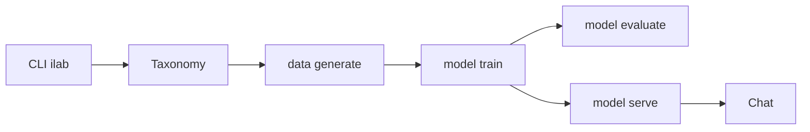

# instructlab/instructlab

> CLI `ilab` d'alignement de LLM par données synthétiques, désormais archivé et éclaté en dépôts séparés.

## Le problème
Ajouter des connaissances ou des compétences à un modèle sans le réentraîner à la main, à partir d'une taxonomie et de données générées.

## Ce que ça fait vraiment
Le README actuel ne décrit plus l'outil : il annonce le déplacement des briques vers des dépôts dédiés (SDG et Training, chez Red Hat AI Innovation Team). D'après le code, le CLI orchestrait config, téléchargement de modèle, génération de données depuis une taxonomie, entraînement (simple, complet, accéléré, en phases), évaluation, service et chat.

## Comment c'est branché

## Essayer
Aucune commande documentée dans le README actuel.

## Coût et pièges
Dépôt archivé : plus de corrections. Le code demandait selon l'architecture du matériel dédié (CUDA, ROCm, MPS) et des modèles Hugging Face ; rien de chiffré dans le README.

## Ce que ce n'est pas
Ce n'est plus le lieu où vit le projet. Ne pas partir de ce dépôt pour un nouveau chantier.

## Alternatives
- Red-Hat-AI-Innovation-Team/sdg_hub : génération de données synthétiques, là où a migré cette brique.
- Red-Hat-AI-Innovation-Team/training_hub : entraînement, là où a migré cette brique.

## Pour toi
Ignorer : archivé, et le README renvoie lui-même vers `sdg_hub` et `training_hub`, à regarder à la place.

