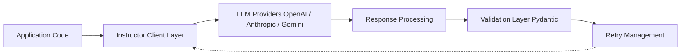

# instructor-ai/instructor

> Bibliothèque Python qui extrait des sorties structurées validées par Pydantic depuis n'importe quel LLM.

## Le problème
Parser du JSON de LLM, valider les champs et relancer en cas d'erreur est fastidieux et propre à chaque fournisseur.

## Ce que ça fait vraiment
On définit un modèle Pydantic et on appelle `client.chat.completions.create(response_model=...)`. Instructor envoie le schéma au fournisseur, valide la réponse et relance avec le message d'erreur (`max_retries`). Un même appel `from_provider("openai/…")` couvre OpenAI, Anthropic, Google, Ollama, Groq. Objets imbriqués et streaming gérés.

## Comment c'est branché


## Essayer
```bash
pip install instructor
```
```python
client = instructor.from_provider("openai/gpt-4o-mini")
user = client.chat.completions.create(response_model=User, messages=[...])
```

## Coût et pièges
Clé du fournisseur et facture de tokens ; chaque relance en consomme. Les chiffres d'usage (3 M de téléchargements) sont ceux du README.

## Ce que ce n'est pas
Pas un framework d'agents : le README renvoie vers PydanticAI pour cela. Ne garantit pas la justesse sémantique, seulement le format.

## Alternatives
- PydanticAI : agents, traces et évaluations avec les mêmes modèles.
- LangChain et LlamaIndex : comparés, jugés plus lourds pour cet usage.

## Pour toi
À adopter pour toute extraction structurée depuis un LLM : API minimale, validation typée, changement de fournisseur sans réécriture.
