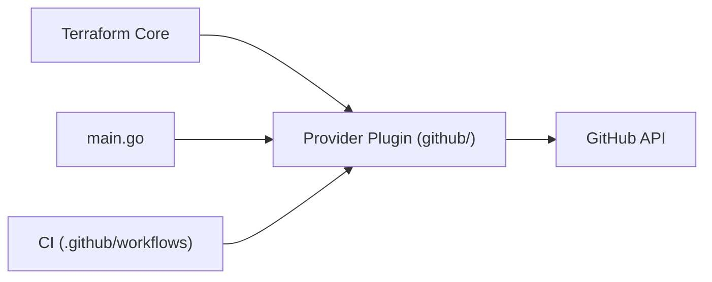

# integrations/terraform-provider-github

> Provider Terraform pour gérer dépôts, équipes, protections et réglages GitHub en infrastructure-as-code.

## Le problème
Configurer à la main dépôts, équipes et protections de branche dérive vite et n'est pas auditable.

## Ce que ça fait vraiment
README très court : gère dépôts, équipes, protections de branche, secrets/variables Actions, réglages d'organisation, rulesets, deploy keys et webhooks, sur GitHub.com et Enterprise Server via REST et GraphQL. Le détail est renvoyé à la documentation du Terraform Registry.

## Comment c'est branché


## Essayer
```hcl
provider "github" {
  owner = "my-org"
}

resource "github_repository" "example" {
  name        = "example-repo"
  description = "Managed by Terraform"
  visibility  = "private"
}
```

## Coût et pièges
Gratuit ; Terraform 1.x requis, Go 1.26.x seulement pour compiler. Jeton ou app GitHub nécessaire (non détaillé dans ce README). 341 issues ouvertes.

## Ce que ce n'est pas
Ce README n'est pas la documentation : matière insuffisante pour juger la couverture des ressources ou l'authentification.

## Alternatives
Le README ne cite aucune alternative.

## Pour toi
À adopter si tu gères une organisation GitHub avec Terraform, mais seulement pour la partie plateforme ; sans intérêt pour le travail data pur.
