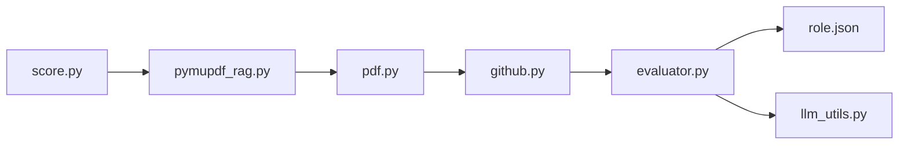

# interviewstreet/hiring-agent

> CLI qui classe des CV PDF selon une grille par rôle, via LLM et signaux GitHub.

## Le problème
HackerRank reçoit 50 à 60 000 candidatures de stage par an : impossible de toutes les lire dans un ordre pertinent.

## Ce que ça fait vraiment
PyMuPDF convertit le PDF en Markdown, puis une extraction par section via des templates Jinja produit un JSON Resume.
Enrichissement GitHub : le LLM choisit 7 dépôts significatifs.
`evaluator.py` note selon un rôle défini dans `roles/<nom>/role.json` (catégories, poids, bonus).
Ollama en local (gemma4) ou Gemini ; export CSV en mode développement.

## Comment c'est branché


## Essayer
```bash
pip install -r requirements.txt
ollama pull gemma4:latest
python score.py ./resume/sample.pdf --role software_engineering_intern
```

## Coût et pièges
Gratuit avec Ollama ; clé Gemini sinon. Les scores varient fortement d'un lancement à l'autre (non-déterminisme), et du texte invisible dans un PDF peut gonfler la note.

## Ce que ce n'est pas
Pas un ATS, et pas l'outil de production de HackerRank : la configuration fournie est une démo. Il pose des questions éthiques et RGPD (article 22).

## Alternatives
Aucune alternative nommée dans le README.

## Pour toi
À surveiller comme étude de cas : pipeline LLM d'extraction et de notation bien structuré, dont la variance documentée enseigne plus que l'outil lui-même.
