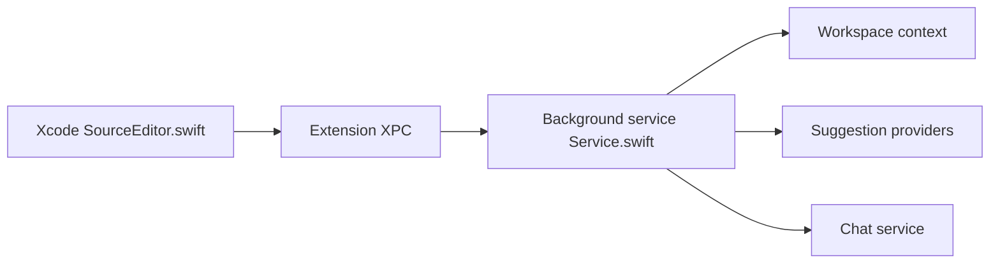

# intitni/CopilotForXcode

> Extension macOS pour Xcode ajoutant suggestions, chat et modification de code via Copilot, Codeium ou OpenAI.

## Le problème
Xcode n'offre pas nativement d'assistant IA de code, ni de chat contextuel.

## Ce que ça fait vraiment
Un service d'arrière-plan lit le contexte de l'éditeur, interroge le fournisseur configuré (GitHub Copilot, Codeium, LLM compatible) et affiche suggestions, chat ou modifications. Des commandes personnalisées permettent des prompts réutilisables. Il demande l'accès Accessibilité et Dossiers.

## Comment c'est branché


## Essayer
```bash
brew install --cask copilot-for-xcode
```
Puis activer l'extension dans Réglages Système et accorder l'Accessibilité.

## Coût et pièges
Abonnement Copilot ou compte Codeium, ou clé OpenAI facturée à l'usage ; Node requis pour le serveur Copilot. Le README admet un suivi d'Xcode fragile avec plusieurs fenêtres.

## Ce que ce n'est pas
Pas un outil hors ligne : il dépend de services tiers. Dernier push en avril 2026, activité modeste.

## Alternatives
Aucune alternative nommée dans le README.

## Pour toi
À ignorer pour un profil data/IA : c'est un outil de développement iOS/macOS, sans lien avec ton périmètre.

