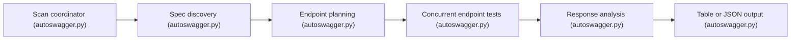

# intruder-io/autoswagger

> Outil en ligne de commande qui repère les specs OpenAPI et signale les endpoints sans authentification exposant des données sensibles.

## Le problème
Des API exposent leur documentation Swagger et des endpoints ouverts qui laissent fuiter des données personnelles ou des secrets, sans que personne ne le remarque.

## Ce que ça fait vraiment
- Trouve la spec : URL directe, pages Swagger UI, ou chemins courants (`/swagger.json`, `/openapi.json`).
- Teste les endpoints GET par défaut (autres méthodes avec `-risk`), en parallèle, avec limite de débit (30 req/s par défaut).
- Analyse les réponses : PII via Presidio, secrets par regex, réponses volumineuses.
- Sortie en tableau ou JSON ; l'éditeur reconnaît que la première version est incomplète.

## Comment c'est branché


## Essayer
```bash
git clone git@github.com:intruder-io/autoswagger.git
pip install -r requirements.txt
python3 autoswagger.py -h
python autoswagger.py https://api.example.com -v
```

## Coût et pièges
Gratuit. Tout le code est dans un seul fichier. Dernier push en août 2025. À lancer uniquement sur des API dont tu as la responsabilité ou l'autorisation, car l'outil envoie de vraies requêtes.

## Ce que ce n'est pas
Pas un scanner complet de sécurité API : certains types de spécifications ne sont pas gérés. Les résultats demandent une vérification manuelle.

## Alternatives
Le README cite Postman et Burp Suite pour rejouer les requêtes et confirmer.

## Pour toi
À surveiller : utile pour auditer tes propres API de données ou de modèles, mais projet peu actif depuis plus d'un an.

