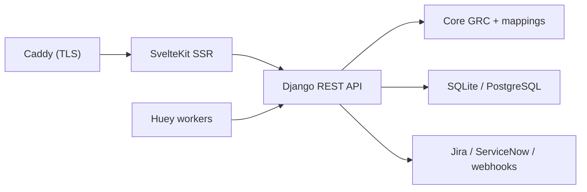

# intuitem/ciso-assistant-community

> Plateforme de gouvernance, risque et conformité en cybersécurité, avec plus de 200 référentiels intégrés.

## Le problème
Les équipes sécurité jonglent entre tableurs et outils pour conformité, risques, tiers et remédiation, avec beaucoup de doublons.

## Ce que ça fait vraiment
Une application Django REST avec frontend SvelteKit qui sépare les contrôles réutilisables de l'évaluation par référentiel. Elle couvre audits, registre des risques, EBIOS RM, DORA, tiers, incidents, workflows d'automatisation, SSO/SCIM, Jira/ServiceNow, Kafka et MCP. Les référentiels sont des bibliothèques YAML ou Excel versionnées. Un sous-système IA (RAG, Qdrant) est optionnel.

## Comment c'est branché


## Essayer
```bash
git clone --single-branch -b main https://github.com/intuitem/ciso-assistant-community.git
cd ciso-assistant-community
./docker-compose.sh
```

## Coût et pièges
L'édition communautaire est gratuite ; un essai cloud existe. Ne pas utiliser `main` en production : préférer les tags. Durcissement nécessaire (`DJANGO_DEBUG=False`, secrets, réseau).

## Ce que ce n'est pas
Pas un outil de data science : c'est un logiciel de conformité. La licence est présente mais non identifiée par GitHub.

## Alternatives
Aucune alternative nommée dans le README.

## Pour toi
À ignorer pour un profil data/IA/MLOps, sauf mission de conformité : hors périmètre technique, et la licence est à vérifier.
