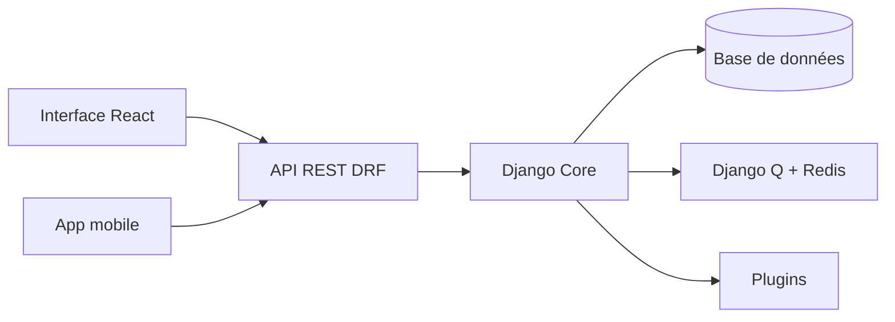

# inventree/InvenTree

> Système open source de gestion d'inventaire et de suivi de pièces, avec API REST et plugins.

## Le problème
Suivre stocks, pièces, fabrications et commandes dans des tableurs devient ingérable.

## Ce que ça fait vraiment
Backend Python/Django avec interface d'administration et API REST (DRF), client React (Mantine, TanStack Query, Zustand), tâches Django Q, Redis, bases PostgreSQL/MySQL/MariaDB/SQLite, système de plugins et application mobile compagnon.

## Comment c'est branché


## Essayer
```bash
wget -qO install.sh https://get.inventree.org && bash install.sh
```

## Coût et pièges
Gratuit, à auto-héberger : base, Redis et maintenance à ta charge.

## Ce que ce n'est pas
Pas un ERP complet ; pas conçu pour l'analyse de données.

## Alternatives
Aucune alternative nommée dans le README.

## Pour toi
Ignorer : application de gestion de stock, sans lien avec data/IA/MLOps hors besoin métier précis.

