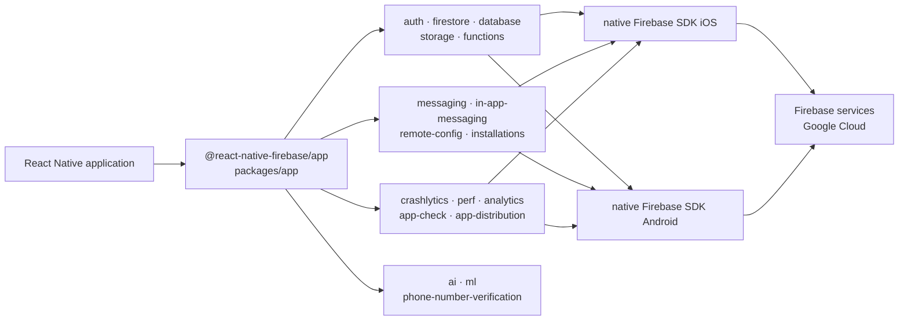

# invertase/react-native-firebase

> **The official React Native modules exposing the native Firebase SDKs on iOS and Android.**

## The problem

Reaching Firebase from a React Native app through the Web SDK falls short: no native push
notifications, no Crashlytics, no native offline persistence. Writing the JavaScript bridge to the
iOS and Android SDKs yourself, module by module, means maintaining a whole interop layer on top of
your application.

## What it actually does

A monorepo of npm packages, one per Firebase service, each a thin JavaScript layer over the
matching native SDK — not a reimplementation of the services.

The pivot package is `@react-native-firebase/app`: you install it first, everything else attaches
to it. The README lists 18 published modules: `ai`, `analytics`, `app`, `app-check`,
`app-distribution`, `auth`, `firestore`, `functions`, `messaging`, `storage`, `crashlytics`,
`in-app-messaging`, `installations`, `ml`, `perf`, `phone-number-verification`, `database`,
`remote-config`.

The stated API mirrors the Firebase Web SDK and is presented as a drop-in replacement, so code can
be shared between mobile and web. TypeScript types ship with it. The README claims over 95% test
coverage per module; that is the repo's own claim, not verified here.

Documentation, installation and API reference all live outside the repo, on `rnfirebase.io`.

## How it is wired



No code-derived diagram exists for this repo: this one is rebuilt from the README's module table.
The shape is what matters — everything goes through `app`, and each module drops down to its
platform's native SDK, never to an HTTP service written here.

## Trying it

```bash
# The README documents NO install command and NO code example.
# It points to the documentation site for getting started and reference:
#   https://rnfirebase.io/          (Quick Start)
#   https://rnfirebase.io/reference (Reference API)
# Nothing is reconstructed here: the only fact the README gives is the pivot package name,
# @react-native-firebase/app, to install before any other module.
```

## Cost and gotchas

- **A Google account and a Firebase project are mandatory**: the modules do nothing without a
  declared project and its iOS/Android configuration files.
- **Firebase billing**: a free tier then usage-based charges on Google Cloud. The README says
  nothing about it; the cost lives outside the repo.
- **License**: the README badge links to `/LICENSE`, but the catalogue reports `NOASSERTION` —
  GitHub could not identify the file. Clear this up before any internal use.
- **Native build chain**: these are not pure JavaScript packages. They carry native code, so
  Xcode, the Android SDK and an app rebuild on every module added. Details are on the site, not
  in the README.
- **18 packages to version together**: a Lerna monorepo where modules track the `app` version;
  mixing them is the classic source of trouble.
- **Analytics and Crashlytics report data** to Google by design: treat as telemetry in any
  regulated context.

## What it is not

- **It is not Firebase.** It is the bridge to Firebase. Services, quotas, availability and the
  bill stay with Google; the repo provides no server.
- **It is not a Web SDK replacement usable anywhere**: the README frames it as a drop-in
  replacement *within React Native*, not as a universal JavaScript library.
- **It is not self-documented**: the README is a table of packages and badges. All the useful
  material — install, API, guides — sits on an external site.

## Alternatives

No comparable alternative among the catalogue neighbours: `wix/Detox` is an end-to-end testing
tool for React Native — complementary, not a substitute; `dcloudio/uni-app`,
`volcengine/MineContext` and `LimeSurvey/LimeSurvey` belong to other domains. The only comparison
named in the README is the **Firebase Web SDK** itself: prefer it if you stay on the web or refuse
any native dependency, at the cost of the native-only features (push notifications, Crashlytics,
performance monitoring).

## For you

Little direct value for a data / AI / MLOps profile: this is mobile application tooling, and the
interesting part — `ai`, `ml`, `analytics` — is only a bridge to Google services whose logic lives
elsewhere. Worth watching only if a mobile product must feed events into a data pipeline, or if
you want a clean example of a native-bridge monorepo. Otherwise, walk on by.
