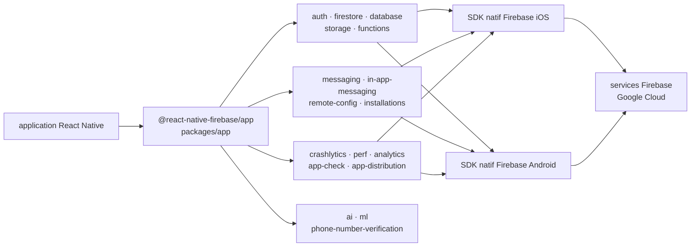

# invertase/react-native-firebase

> **Les modules React Native officiels qui exposent les SDK natifs Firebase iOS et Android.**

## Le problème

Depuis une application React Native, atteindre Firebase par le SDK Web fonctionne mal : pas de
notifications push natives, pas de Crashlytics, pas de persistance hors ligne côté natif. Écrire
soi-même le pont JavaScript vers les SDK natifs iOS et Android, module par module, revient à
maintenir une couche d'interopérabilité entière en plus de son application.

## Ce que ça fait vraiment

C'est un monorepo de paquets npm, un par service Firebase, chacun étant une couche JavaScript
mince posée sur le SDK natif correspondant — pas une réimplémentation des services.

Le paquet pivot est `@react-native-firebase/app` : c'est lui qu'on installe d'abord, les autres
s'y greffent. Le README liste 18 modules publiés : `ai`, `analytics`, `app`, `app-check`,
`app-distribution`, `auth`, `firestore`, `functions`, `messaging`, `storage`, `crashlytics`,
`in-app-messaging`, `installations`, `ml`, `perf`, `phone-number-verification`, `database`,
`remote-config`.

L'API annoncée reflète celle du SDK Web Firebase, présentée comme remplacement direct afin de
partager le code entre mobile et web. Les types TypeScript sont fournis. Le README annonce une
couverture de tests supérieure à 95 % par module ; c'est une affirmation du dépôt, non vérifiée ici.

La documentation, l'installation et la référence d'API vivent hors du dépôt, sur `rnfirebase.io`.

## Comment c'est branché



Aucun diagramme tiré du code n'existe pour ce dépôt : ce schéma est reconstruit depuis la table
des modules du README. Le point à retenir est la forme en étoile — tout passe par `app`, et
chaque module descend vers le SDK natif de sa plateforme, jamais vers un service HTTP écrit ici.

## Essayer

```bash
# Le README ne documente AUCUNE commande d'installation ni d'exemple de code.
# Il renvoie au site de documentation pour le démarrage rapide et la référence :
#   https://rnfirebase.io/          (Quick Start)
#   https://rnfirebase.io/reference (Reference API)
# Rien n'est reconstruit ici : la seule information du README est le nom du paquet pivot,
# @react-native-firebase/app, à installer avant tout autre module.
```

## Coût et pièges

- **Compte Google et projet Firebase obligatoires** : les modules ne servent à rien sans projet
  déclaré côté Firebase, avec les fichiers de configuration iOS et Android associés.
- **Facturation Firebase** : le modèle de Firebase est un palier gratuit puis une facturation à
  l'usage côté Google Cloud. Le README n'en parle pas ; c'est du coût hors dépôt.
- **Licence** : le badge du README pointe vers `/LICENSE`, mais le catalogue relève
  `NOASSERTION` — GitHub n'a pas su identifier le fichier. À lever avant tout usage interne.
- **Chaîne de compilation native** : ce ne sont pas des paquets JavaScript purs. Ils embarquent
  du code natif, donc Xcode, le SDK Android et une reconstruction de l'application à chaque
  ajout de module. Les détails ne sont pas dans le README mais sur `rnfirebase.io`.
- **18 paquets à versionner ensemble** : monorepo géré avec Lerna, les modules suivent la version
  de `app` ; les mélanger est la source d'ennuis classique.
- **Analytics et Crashlytics remontent des données** vers Google par construction : à traiter
  comme de la télémétrie dans un contexte réglementé.

## Ce que ce n'est pas

- **Ce n'est pas Firebase.** C'est le pont vers Firebase. Les services, les quotas, la
  disponibilité et la facture restent chez Google ; le dépôt ne fournit aucun serveur.
- **Ce n'est pas un remplaçant du SDK Web utilisable partout** : le README le présente comme un
  remplacement direct *en React Native*, pas comme une bibliothèque JavaScript universelle.
- **Ce n'est pas un projet auto-documenté** : le README est une table de paquets et de badges.
  Toute la matière utile — installation, API, guides — est sur un site externe, hors dépôt.

## Alternatives

Aucune alternative comparable parmi les voisins fournis par le catalogue : `wix/Detox` est un
outil de test de bout en bout pour React Native — complémentaire, pas substituable ;
`dcloudio/uni-app`, `volcengine/MineContext` et `LimeSurvey/LimeSurvey` relèvent d'autres
domaines. La seule comparaison nommée dans le README est le **SDK Web Firebase** lui-même : à
préférer si l'on reste sur le web ou si l'on refuse toute dépendance native, au prix des
fonctions réservées au natif (notifications push, Crashlytics, performance).

## Pour toi

Peu de valeur directe pour un profil data / IA / MLOps : c'est de l'outillage d'application
mobile, et la partie intéressante — `ai`, `ml`, `analytics` — n'est qu'un pont vers des services
Google dont la logique vit ailleurs. À surveiller seulement si un produit mobile doit alimenter
en événements une chaîne de données, ou si l'on cherche un exemple de monorepo de ponts natifs
tenu proprement. Sinon, passer son chemin.
