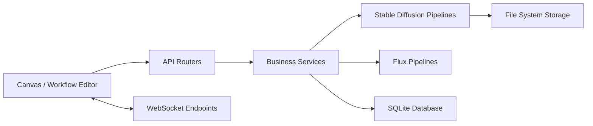

# invoke-ai/InvokeAI

> Application locale de génération d'images (Stable Diffusion, FLUX) avec canvas et workflows nodaux.

## Le problème
Générer et retoucher des images avec les modèles de diffusion récents demande d'orchestrer modèles, pipelines et interface soi-même.

## Ce que ça fait vraiment
Serveur web local (FastAPI + React) avec Unified Canvas (in/out-painting, pinceaux), éditeur de workflows par nœuds et galerie.
Supporte ckpt, diffusers et certains gguf ; gestionnaire de modèles, upscaling, SAM/SAM2.
File d'exécution asynchrone, événements poussés par WebSocket, persistance SQLite + fichiers.
Base de plusieurs produits commerciaux de l'éditeur.

## Comment c'est branché

## Essayer
Aucune commande documentée : le README renvoie au téléchargement du Launcher.

## Coût et pièges
Gratuit (Apache-2.0) ; GPU compatible requis, poids de modèles volumineux à télécharger (HuggingFace).

## Ce que ce n'est pas
Pas une bibliothèque Python à intégrer dans ton code : c'est une application. Les licences des modèles chargés (ex. FLUX dev) restent à ta charge.

## Alternatives
Aucune alternative nommée dans le README.

## Pour toi
Surveiller : bon atelier créatif local, mais hors cœur data/MLOps sauf besoin de génération d'images pour prototypes.
