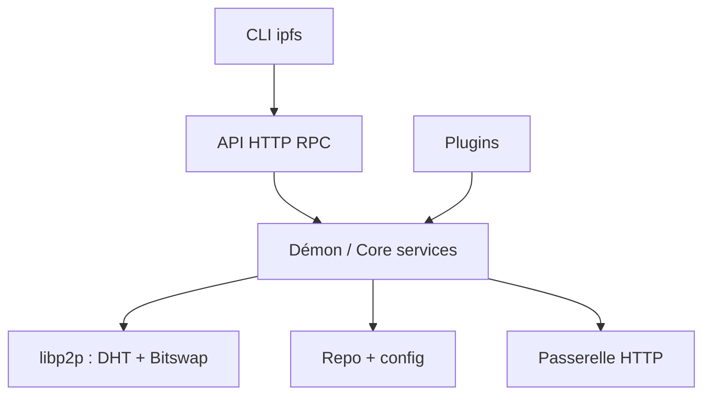

# ipfs/kubo

> Implémentation Go de référence d'IPFS : un nœud de stockage adressé par le contenu, en réseau pair à pair.

## Le problème
Distribuer et vérifier des fichiers ou jeux de données sans serveur central, en les adressant par leur empreinte (CID).

## Ce que ça fait vraiment
Un démon expose un nœud IPFS : DHT Amino en WAN et mDNS en LAN, échange de blocs par Bitswap, passerelle HTTP, API RPC HTTP, client et serveur de routage HTTP V1, interface web, montages FUSE expérimentaux, blocage de contenu pour opérateurs publics. La CLI `ipfs` pilote le démon. Un système de plugins permet d'ajouter des datastores.

## Comment c'est branché


## Essayer
```bash
ipfs init --profile=unixfs-v1-2025
ipfs daemon &
echo "hello IPFS" | ipfs add -q
docker run --rm -it --net=host ipfs/kubo:latest
```

## Coût et pièges
Gratuit, mais 6 Go de RAM et 2 cœurs recommandés ; environ 1 Gio de RAM par 20 millions d'éléments épinglés. Point crucial : le README indique qu'il n'y a plus de mainteneur dédié et que le travail de Shipyard s'arrête le 30 septembre 2026. Les paquets tiers de distributions ne sont pas vérifiés par le projet.

## Ce que ce n'est pas
Ce n'est pas un stockage garanti : sans épinglage ni disponibilité des pairs, les données peuvent disparaître. Ce n'est pas privé par défaut.

## Alternatives
Helia (implémentation JavaScript, citée dans le README).

## Pour toi
À surveiller : pertinent pour distribuer des jeux de données ou modèles adressés par hash, mais l'avenir de la maintenance est incertain et la licence est à vérifier.

