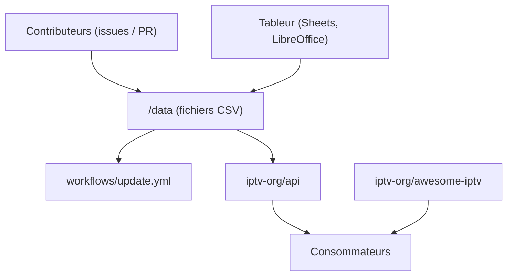

# iptv-org/database

> Base de données éditable par les utilisateurs recensant les chaînes de télévision.

## Le problème
Les métadonnées de chaînes TV (identifiants, pays, langues, catégories) sont dispersées et
propriétaires, sans source communautaire facile à corriger.

## Ce que ça fait vraiment
Le README est court. Toutes les données sont stockées dans le dossier `/data` en fichiers CSV,
donc éditables avec n'importe quel tableur — Google Sheets, LibreOffice. Les mêmes données
sont exposées via une API, dont la documentation vit dans le dépôt `iptv-org/api`. Les
contributions passent par des issues et des pull requests, avec un guide de contribution à
lire au préalable. Un onglet Discussions sert aux questions et aux idées. Un badge de workflow
GitHub Actions `update.yml` figure en tête du README, ce qui suggère une mise à jour
automatisée, mais le README n'en dit rien de plus. Des ressources IPTV complémentaires sont
listées dans `iptv-org/awesome-iptv`.

## Comment c'est branché

## Essayer
Aucune commande documentée : le dépôt se consulte, se télécharge ou s'interroge via l'API du
dépôt `iptv-org/api`.

## Coût et pièges
Gratuit. Le README ne dit rien de la licence des données, de leur volumétrie, de leur fraîcheur
ni de leur exactitude — ce sont des contributions communautaires libres. Il ne s'agit pas de
flux vidéo mais de métadonnées ; la question des droits sur les flux associés est hors sujet
ici mais réelle en aval.

## Ce que ce n'est pas
Ce n'est pas une liste de flux IPTV et ce n'est pas un lecteur : c'est un référentiel de
métadonnées en CSV. Ce n'est pas non plus l'API : celle-ci est un dépôt séparé. Le README est
trop mince pour aller plus loin — matière insuffisante.

## Alternatives
- `iptv-org/api`, si tu veux consommer plutôt qu'éditer.
- `iptv-org/awesome-iptv`, pour les ressources liées.

## Pour toi
Rien à en tirer pour un profil data / IA / MLOps, sauf comme jeu de données CSV de démonstration.
