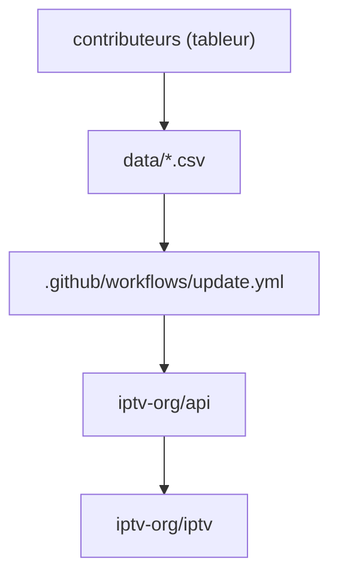

# iptv-org/database

> Base éditable des chaînes de télévision, stockée en CSV et modifiable au tableur.

## Le problème
Décrire des milliers de chaînes de télévision — nom, pays, langue, catégorie — demande une
source unique que des contributeurs non développeurs puissent corriger.

## Ce que ça fait vraiment
Range toutes les données dans `/data` en fichiers CSV, éditables avec n'importe quel tableur
(Google Sheets, LibreOffice). Les mêmes données sont exposées par API, documentée dans le dépôt
`iptv-org/api`. Un workflow CI (`update.yml`) tient le dépôt à jour. C'est la source dont
`iptv-org/iptv` tire les métadonnées de ses playlists.

## Comment c'est branché

## Essayer
Aucune commande documentée dans le README : les fichiers de `/data` se lisent et s'éditent
directement, et l'accès programmatique passe par le dépôt `iptv-org/api`.

## Coût et pièges
Gratuit et sans dépendance, mais le README est très court : ni schéma des colonnes, ni licence,
ni garantie de fraîcheur. Il faut ouvrir les CSV pour savoir ce qu'ils contiennent.

## Ce que ce n'est pas
Ce n'est pas une liste de flux : aucune URL de stream ici, elles sont dans `iptv-org/iptv`.
Ce n'est pas une API — c'est le magasin derrière, l'API est un dépôt distinct. Et ce n'est pas
un référentiel officiel des diffuseurs, seulement une base communautaire.

## Alternatives
- `iptv-org/api` — si on veut interroger ces données au lieu de lire des CSV.
- `iptv-org/iptv` — si ce sont les flux qu'on cherche, pas les métadonnées.

## Pour toi
Un CSV public propre, correct comme jeu de test ; aucun intérêt métier data ou MLOps.
