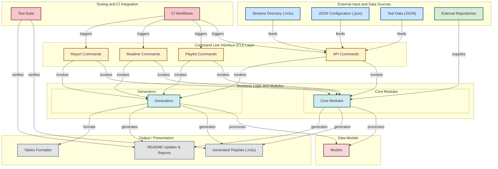

# iptv-org/iptv

> **A community-maintained index of links to public TV streams, to paste into a video player.**

## The problem

Free-to-air TV channels do exist on the open internet, but their stream URLs are scattered,
change without notice and are collected nowhere in particular. Without a maintained directory
everyone redoes the same gathering work, and a URL that worked yesterday may be dead today with
no way to tell whether the stream or the network gave up.

## What it actually does

The repository gathers `.m3u` files pointing at publicly available IPTV streams from around the
world. The README is explicit: **no video files are stored here**, only user-submitted links to
streams that, to the maintainers' knowledge, were made public by the copyright holders.

One main playlist aggregates every channel in the repository; derived playlists (by country,
language, category, region) are listed in `PLAYLISTS.md`. Channel metadata does not live here
but in `iptv-org/database`, and data errors are to be reported there, not in this repository.

Around the `.m3u` files sits a set of TypeScript scripts (playlist generation, README updating,
report commands) that produce and check the published files, automated by the `update.yml`
GitHub Actions workflow visible in the README badge.

## How it is wired



This diagram is derived from the repository's own code. The names matter: `streams/` holds the
raw `.m3u` files, `scripts/commands/{api,playlist,readme,report}` are the command-line entry
points, `scripts/core` and `scripts/generators` the generation logic, `scripts/models` the data
structures (Channel, Country, Language, Region, Playlist), `scripts/tables` the formatting, and
`.github/workflows` drives the whole thing. The repository is at once the published data and the
tooling that publishes it.

## Trying it

The README documents no installation command: the usage is to paste a playlist link into any
video player that supports live streaming and press _Open_.

```
https://iptv-org.github.io/iptv/index.m3u
```

Other playlists are listed in `PLAYLISTS.md`, answers in `FAQ.md`, contribution rules in
`CONTRIBUTING.md`. No build command is given in the README.

## Cost and traps

- **Nothing to install, nothing to pay**: no key, no account, no quota on the repository side.
  The only prerequisite is a player that handles live streams.
- **Everything depends on third-party hosts.** The links point at servers over which, as the
  README says, the project has **no control**. A stream can vanish, become geo-blocked or move
  without notice, and the playlist itself is served from GitHub Pages.
- **The legal question is addressed head-on in the README** and deserves reading before any
  professional use: the repository stores no video, but the links lead to content whose rights
  and availability you do not control. A claim procedure exists on the repository side; it does
  not remove the content from the web.
- **Licence worth checking**: the catalogue records `Unlicense` while the README shows a CC0
  badge. Both are copyright waivers, but the discrepancy is settled by reading the `LICENSE`
  file. Either way it covers the repository's files only, never the streams they point to.
- **Channel data lives elsewhere**: fixing a name or a logo happens in `iptv-org/database`.

## What it is not

- **Not a streaming service or a host.** The repository broadcasts nothing; it lists URLs. No
  availability guarantee, no service contract, no redundancy.
- **Not a library to import.** The TypeScript scripts exist to produce this repository's `.m3u`
  files, not to be installed in a third-party project; the README offers neither an npm package
  nor a public API.
- **Not a programme guide**: the EPG is a separate project (`iptv-org/epg`), and a playlist on
  its own does not say what airs when.
- **Not a continuously verified catalogue from the user's side**: the share of dead links at any
  given moment is not stated in the README.

## Alternatives

No comparable alternative in the catalogue: the suggested neighbours (`soimort/you-get`,
`restic/restic`, `weaviate/weaviate`, `NodeBB/NodeBB`) are respectively a media downloader, a
backup tool, a vector database and a forum engine — matched by vocabulary, unrelated to a stream
directory. The only repositories named in the README are sibling projects from the same
organisation, which complement it rather than replace it: `iptv-org/database` for channel
metadata, `iptv-org/epg` for the programme guide, `iptv-org/api` for programmatic access,
`iptv-org/awesome-iptv` for players and resources.

## For you

Little value as a data or AI building block: it is neither a clean dataset nor a stable API, and
link volatility rules it out as a production source. Two uses still hold — a supply of public
video streams to exercise a real-time pipeline (OCR, detection, transcription) without setting up
capture hardware, and a textbook case of a Git repository that is its own database, regenerated
and checked by CI on every commit. Worth watching, not worth depending on.
