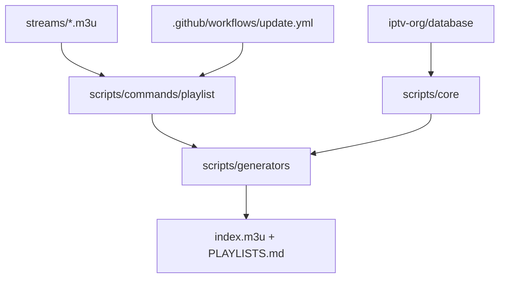

# iptv-org/iptv

> Collection de playlists M3U de chaînes de télévision publiques, à ouvrir dans n'importe quel lecteur.

## Le problème
Les flux de télévision en clair sont éparpillés, changent d'adresse et meurent sans avertissement.
Maintenir sa propre liste de chaînes, c'est une vérification manuelle sans fin.

## Ce que ça fait vraiment
Publie une playlist agrégée à `https://iptv-org.github.io/iptv/index.m3u`, plus des playlists
découpées listées dans `PLAYLISTS.md`. Les flux sont stockés en fichiers `.m3u` dans `streams/`,
et les métadonnées des chaînes viennent d'un dépôt séparé, `iptv-org/database`. Des scripts CI
regénèrent les playlists et le README à chaque mise à jour. Le guide de programmes (EPG) est
fourni à part par `iptv-org/epg`, et une API par `iptv-org/api`.

## Comment c'est branché


## Essayer
```
https://iptv-org.github.io/iptv/index.m3u
```
Coller ce lien dans un lecteur vidéo qui gère le direct, puis _Ouvrir_. Aucune installation.

## Coût et pièges
Gratuit, rien à installer, aucune clé. En revanche le projet ne maîtrise pas la destination des
liens : un flux peut être mort, géobloqué, ou relever du droit d'auteur du diffuseur.

## Ce que ce n'est pas
Ce n'est pas un hébergeur : aucun fichier vidéo n'est stocké ici, seulement des liens soumis
par les utilisateurs. Ce n'est pas un service garanti — ni disponibilité, ni légalité des flux
pointés. Et ce n'est pas la base de données des chaînes, qui vit dans un autre dépôt.

## Alternatives
- `iptv-org/epg` — si c'est le guide des programmes qu'on veut, pas les flux.
- `iptv-org/api` — si on veut interroger les données par API plutôt que lire un M3U.
- `iptv-org/awesome-iptv` — pour repérer d'autres ressources du même domaine.

## Pour toi
Utile comme jeu de données de flux publics à sonder ; sans valeur pour une chaîne data ou MLOps.
