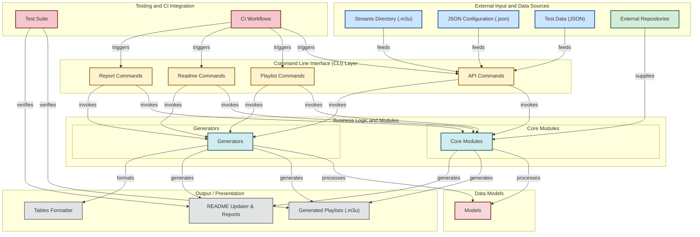

# iptv-org/iptv

> **Un catalogue collaboratif de liens vers des flux TV publics, à ouvrir dans un lecteur vidéo.**

## Le problème

Les chaînes de télévision diffusées en clair sur Internet existent, mais leurs adresses de flux
sont éparpillées, changent sans prévenir et ne sont regroupées nulle part. Sans un annuaire
tenu à jour, chacun refait le même travail de collecte, et une URL trouvée hier peut être morte
aujourd'hui sans qu'on sache si c'est le flux ou le réseau qui a lâché.

## Ce que ça fait vraiment

Le dépôt rassemble des fichiers `.m3u` pointant vers des flux IPTV publics du monde entier. Le
README est explicite : **aucun fichier vidéo n'est stocké ici**, uniquement des liens soumis par
les contributeurs vers des flux rendus publics par leurs détenteurs de droits.

Une playlist principale agrège toutes les chaînes du dépôt ; des playlists dérivées (par pays,
langue, catégorie, région) sont listées dans `PLAYLISTS.md`. Les métadonnées des chaînes ne
viennent pas de ce dépôt mais de `iptv-org/database`, et les erreurs de données doivent y être
signalées, pas ici.

Autour des `.m3u`, un jeu de scripts TypeScript (commandes de génération de playlists, de mise à
jour du README, de rapports) produit et vérifie les fichiers publiés, automatisé par un workflow
GitHub Actions `update.yml` visible dans le badge du README.

## Comment c'est branché



Ce schéma est tiré du code du dépôt. Les noms comptent : `streams/` contient les `.m3u` bruts,
`scripts/commands/{api,playlist,readme,report}` sont les points d'entrée en ligne de commande,
`scripts/core` et `scripts/generators` la logique de génération, `scripts/models` les structures
(Channel, Country, Language, Region, Playlist), `scripts/tables` le formatage, et
`.github/workflows` déclenche l'ensemble. Le dépôt est donc à la fois la donnée publiée et
l'outillage qui la publie.

## Essayer

Le README ne documente aucune commande d'installation : l'usage est de coller le lien de la
playlist dans un lecteur vidéo qui gère le direct, puis _Open_.

```
https://iptv-org.github.io/iptv/index.m3u
```

Les autres playlists sont listées dans `PLAYLISTS.md`, la FAQ dans `FAQ.md` et les règles de
contribution dans `CONTRIBUTING.md`. Aucune commande de build n'est donnée dans le README.

## Coût et pièges

- **Rien à installer, rien à payer** : pas de clé, pas de compte, pas de quota côté dépôt. Le
  seul prérequis est un lecteur vidéo qui lit le direct.
- **Tout dépend d'hébergeurs tiers.** Les liens pointent vers des serveurs sur lesquels le
  projet n'a, dit le README, **aucun contrôle**. Un flux peut disparaître, se géobloquer ou
  changer d'adresse sans préavis, et la playlist elle-même est servie depuis GitHub Pages.
- **Le point juridique est traité franchement dans le README** et mérite d'être lu avant tout
  usage professionnel : le dépôt ne stocke pas de vidéo, mais les liens mènent à des contenus
  dont vous ne maîtrisez ni les droits ni la disponibilité. Une procédure de réclamation
  existe côté dépôt ; elle ne retire pas le contenu du web.
- **Licence à vérifier** : le lot relève `Unlicense`, le README affiche un badge CC0. Les deux
  sont des renonciations au droit d'auteur, mais la divergence se lève sur le fichier `LICENSE`.
  Cela ne couvre de toute façon que les fichiers du dépôt, jamais les flux pointés.
- **Les données de chaînes vivent ailleurs** : corriger un nom ou un logo se fait dans
  `iptv-org/database`, pas ici.

## Ce que ce n'est pas

- **Ce n'est pas un service de streaming ni un hébergeur.** Le dépôt ne diffuse rien ; il liste
  des URL. Aucune garantie de disponibilité, aucun contrat de service, aucune redondance.
- **Ce n'est pas une bibliothèque à importer.** Les scripts TypeScript existent pour produire
  les `.m3u` de ce dépôt, pas pour être installés dans un projet tiers ; le README ne propose
  ni paquet npm ni API publique.
- **Ce n'est pas un guide de programmes** : l'EPG est un projet séparé (`iptv-org/epg`), et la
  playlist seule ne dit pas ce qui passe à quelle heure.
- **Ce n'est pas un catalogue vérifié en continu côté utilisateur** : la proportion de liens
  morts à un instant donné n'est pas annoncée dans le README.

## Alternatives

Aucune alternative comparable dans le catalogue : les voisins proposés (`soimort/you-get`,
`restic/restic`, `weaviate/weaviate`, `NodeBB/NodeBB`) sont respectivement un téléchargeur de
médias, un outil de sauvegarde, une base vectorielle et un moteur de forum — rapprochés par
lexique, sans rapport avec un annuaire de flux TV. Les seuls dépôts nommés dans le README sont
les projets frères de la même organisation, qui le complètent au lieu de le remplacer :
`iptv-org/database` pour les métadonnées de chaînes, `iptv-org/epg` pour le guide de programmes,
`iptv-org/api` pour l'accès programmatique, `iptv-org/awesome-iptv` pour les lecteurs et
ressources.

## Pour toi

Peu d'intérêt comme brique data ou IA : ce n'est ni un jeu de données propre ni une API stable,
et la volatilité des liens interdit d'en faire une source de production. Deux usages tiennent
quand même — une source de flux vidéo publics pour éprouver une chaîne de traitement temps réel
(OCR, détection, transcription) sans monter de capture, et un cas d'école de dépôt Git qui est
sa propre base de données, régénérée et vérifiée par CI à chaque commit. À surveiller, pas à
adopter comme dépendance.
