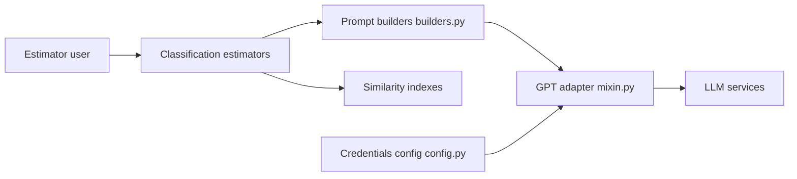

# iryna-kondr/scikit-llm

> Estimateurs de type scikit-learn qui appellent des LLM pour classifier, résumer ou vectoriser du texte.

## Le problème
Utiliser un LLM pour de la classification de texte oblige à écrire prompts, appels API et parsing, hors du flux fit/predict habituel de scikit-learn.

## Ce que ça fait vraiment
Estimateurs `fit` / `predict` pour classification zéro-shot et few-shot, étiquetage d'entités, résumé, traduction et vectorisation. Adaptateurs GPT, Anthropic et Vertex ; le few-shot peut chercher des exemples voisins dans un index en mémoire. Les prompts sont construits par des builders et templates internes.

## Comment c'est branché


## Essayer
```bash
pip install scikit-llm
```
```python
from skllm.config import SKLLMConfig
from skllm.models.gpt.classification.zero_shot import ZeroShotGPTClassifier
SKLLMConfig.set_openai_key("<YOUR_KEY>")
clf = ZeroShotGPTClassifier(model="gpt-4")
clf.fit(X, y)
clf.predict(X)
```

## Coût et pièges
Chaque prédiction appelle l'API du fournisseur : facture à ta charge, proportionnelle au volume. README minimal, le détail est dans la documentation externe.

## Ce que ce n'est pas
Pas un classifieur local ni entraîné : c'est un appel de LLM déguisé en estimateur, avec latence et coût par ligne.

## Alternatives
Aucune alternative nommée dans le README.

## Pour toi
À adopter pour prototyper vite de la classification textuelle zéro-shot dans un pipeline scikit-learn ; garde un œil sur le coût au volume.

