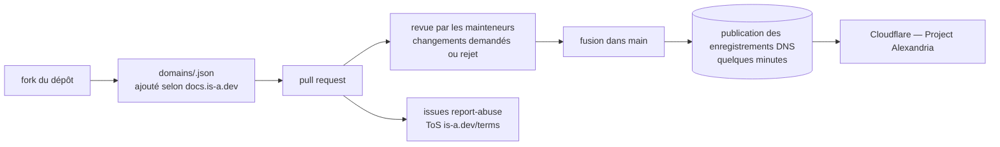

# is-a-dev/register

> **A free `.is-a.dev` subdomain for your personal site, requested by pull request on this repository.**

## The problem

Putting a project or a portfolio behind an address of your own means buying a domain name,
renewing it every year and handling DNS records yourself. For a personal site that does not
justify the expense, you fall back on a platform URL (`user.github.io`, a host's subdomain)
that you neither control nor can take elsewhere.

## What it actually does

The repository is the registry of a service handing out `.is-a.dev` subdomains to developers,
free of charge, for their personal websites. The request goes through the repository itself:
you fork it, add your entry under the `domains` directory following the documentation at
`docs.is-a.dev`, then open a pull request. It is reviewed by maintainers; if changes are
requested and not made, it is rejected. Once merged, the README says DNS records should be
published "within a few minutes".

The README documents neither the domain file format, nor the accepted record types, nor the
timings: all of that is deferred to `docs.is-a.dev`, outside the repository. Two explicit
instructions do appear: do not use AI to generate your request (the README states it will
always get it wrong and delay you), and report abused subdomains by opening an issue with the
`report-abuse` template and relevant evidence. DNS management runs through Cloudflare's
Project Alexandria program, and non-critical announcements go to a Discord server rather than
to GitHub.

## How it is wired

No code-derived diagram exists for this repository: this one is reconstructed from the README
alone, and the `domains` directory name comes from the file-count badge it displays. What
happens between the merge and the DNS publication is not described in the README.

## Trying it

The README contains **no command**: the whole path is described in prose and happens in
GitHub's web interface.

- Fork the repository via `https://github.com/is-a-dev/register/fork`.
- Follow the instructions at `https://docs.is-a.dev` to write your entry.
- Open the pull request, then watch it for requested changes.
- After the merge, wait for the DNS records to be published.

The README points to one third-party visual guide: a 2024 blog post on
`blog.wharrison.com.au`.

## Cost and traps

- **Free, but not without strings**: you need a GitHub account, you must accept the terms of
  service at `is-a.dev/terms`, and you go through a human review whose turnaround is not
  stated.
- **Dependency on non-contractual third parties**: DNS rests on Cloudflare's Project
  Alexandria program, while service announcements and downtime notices live on a Discord
  server. The README says only critical announcements are posted on GitHub — not following
  the Discord means hearing about incidents last.
- **The repository is not the documentation**: entry format, accepted records, naming rules
  and grounds for rejection all live on `docs.is-a.dev`. The README alone is not enough to
  prepare a request.
- **Rejection is a real outcome**: a pull request whose requested changes are not made gets
  rejected, and AI-written requests are explicitly discouraged.
- **Reversibility**: nothing in the README about how long a subdomain lasts, how it can be
  revoked, or how to leave. A subdomain granted is a subdomain that can be taken back.

## What it is not

- **Not a host.** The service publishes DNS records; the site itself still has to be hosted
  somewhere else (Pages, VPS, platform). Nothing here serves web content.
- **Not a domain of your own.** It is a subdomain under someone else's domain: you do not own
  it, you cannot transfer it, and its fate depends on the project and its registrar.
- **Not code to install.** Despite the JavaScript language recorded in the catalogue, what you
  consume here is a service: nothing to clone to use it, nothing to run yourself.
- **Not a service with any level of commitment**: no SLA, no support, volunteer administration
  funded by donations and sponsorship.
- **Not meant for professional or production use**: the README talks about developers'
  personal websites.

## Alternatives

| | When to prefer it |
|---|---|
| **free-domains/is-a.bot** | Named in the README: same team, same pull-request mechanism, for `.is-a.bot` subdomains. Prefer it when the project is a bot and the suffix should say so. |
| **js-org/js.org** | A catalogue neighbour and the closest comparable: free `.js.org` subdomains granted by pull request on a repository. Prefer it for a JavaScript project, where the suffix speaks louder. |

The other suggested neighbour, `owasp-amass/amass`, is not comparable: it is a subdomain
enumeration and reconnaissance tool for security work — it inspects other people's DNS instead
of handing any out.

## For you

Unrelated to data or MLOps: this is a personal-visibility convenience, useful if you want a
short readable address for a portfolio, a demo or an open-source project page, with no budget
line and no renewal. Worth watching rather than adopting: the dependency on a community
project's goodwill and the absence of any retention guarantee rule out putting anything there
beyond a disposable or easily redirected site. For anything professional or long-lived, buy a
domain.
