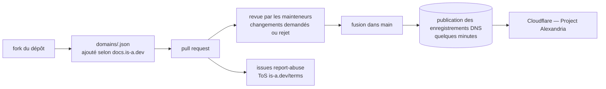

# is-a-dev/register

> **Un sous-domaine `.is-a.dev` gratuit pour son site perso, demandé par pull request sur ce dépôt.**

## Le problème

Publier un projet ou un portfolio sous une adresse à soi suppose d'acheter un nom de domaine,
de le renouveler chaque année et de gérer soi-même les enregistrements DNS. Pour un site
personnel qui ne justifie pas cette dépense, on retombe sur une URL de plateforme
(`utilisateur.github.io`, sous-domaine d'hébergeur) qu'on ne contrôle pas et qu'on ne peut pas
emporter ailleurs.

## Ce que ça fait vraiment

Le dépôt est le registre d'un service qui distribue des sous-domaines `.is-a.dev` à des
développeurs, gratuitement, pour leurs sites personnels. La demande passe par le dépôt
lui-même : on le forke, on ajoute son entrée dans le répertoire `domains` en suivant la
documentation publiée sur `docs.is-a.dev`, puis on ouvre une pull request. Elle est relue par
des mainteneurs ; si des changements sont demandés et non faits, elle est rejetée. Une fois
fusionnée, le README annonce des enregistrements DNS publiés « en quelques minutes ».

Le README ne documente ni le format du fichier de domaine, ni les types d'enregistrements
acceptés, ni les délais : tout cela est renvoyé à `docs.is-a.dev`, hors du dépôt. Deux
consignes explicites y figurent tout de même : ne pas générer sa demande avec une IA (le
README affirme que le résultat sera toujours faux et retardera l'attribution), et signaler les
sous-domaines abusifs en ouvrant une issue avec le gabarit `report-abuse` et des preuves. La
gestion DNS est assurée via le programme Project Alexandria de Cloudflare, et les annonces
non critiques passent par un serveur Discord plutôt que par GitHub.

## Comment c'est branché

Aucun diagramme tiré du code n'existe pour ce dépôt : ce schéma est reconstruit depuis le seul
README, et le nom du répertoire `domains` vient du badge de comptage de fichiers qu'il affiche.
La mécanique de publication entre la fusion et le DNS n'est pas décrite dans le README.

## Essayer

Le README ne contient **aucune commande** : le parcours est entièrement décrit en prose et se
fait dans l'interface web de GitHub.

- Forker le dépôt via `https://github.com/is-a-dev/register/fork`.
- Suivre les instructions de `https://docs.is-a.dev` pour rédiger son entrée.
- Ouvrir la pull request, puis surveiller les demandes de changement.
- Après fusion, attendre la publication des enregistrements DNS.

Un guide visuel tiers est signalé par le README : un billet de blog sur
`blog.wharrison.com.au` (2024).

## Coût et pièges

- **Gratuit, mais pas sans contrepartie** : il faut un compte GitHub, accepter les conditions
  d'utilisation publiées sur `is-a.dev/terms`, et passer par une revue humaine dont le délai
  n'est pas annoncé.
- **Dépendance à des tiers non contractuels** : le DNS repose sur le programme Project
  Alexandria de Cloudflare, les annonces de service et les avis d'indisponibilité sur un
  serveur Discord. Le README précise que seules les annonces critiques sont relayées sur
  GitHub — ne pas suivre le Discord, c'est apprendre les incidents en dernier.
- **Le dépôt n'est pas la documentation** : format d'entrée, enregistrements acceptés, règles
  de nommage et motifs de rejet vivent sur `docs.is-a.dev`. Le README seul ne suffit pas pour
  préparer une demande.
- **Rejet possible** : une pull request dont les changements demandés ne sont pas faits est
  rejetée ; les demandes rédigées par une IA sont explicitement découragées.
- **Réversibilité** : rien dans le README sur la durée de vie d'un sous-domaine, la
  révocation, ou la marche à suivre pour partir. Un sous-domaine offert reste révocable.

## Ce que ce n'est pas

- **Ce n'est pas un hébergeur.** Le service publie des enregistrements DNS ; le site, lui,
  reste à héberger ailleurs (Pages, VPS, plateforme). Rien ici ne sert de serveur web.
- **Ce n'est pas un nom de domaine à soi.** C'est un sous-domaine sous un domaine tiers :
  on ne le possède pas, on ne peut pas le transférer, et son sort dépend du projet et de son
  registrar.
- **Ce n'est pas du code à installer.** Malgré le langage JavaScript déclaré par le
  catalogue, ce qu'on consomme ici est un service : rien à cloner pour s'en servir, rien à
  faire tourner chez soi.
- **Ce n'est pas un service à engagement de niveau** : pas de SLA, pas de support, une
  administration bénévole financée par des dons et du sponsoring.
- **Ce n'est pas destiné à un usage professionnel ou de production** : le README parle de
  sites personnels de développeurs.

## Alternatives

| | Quand le préférer |
|---|---|
| **free-domains/is-a.bot** | Nommé dans le README : même équipe, même mécanique de pull request, pour des sous-domaines `.is-a.bot`. À préférer si le projet est un bot et que le suffixe doit le dire. |
| **js-org/js.org** | Voisin du catalogue, et le comparable le plus direct : sous-domaines `.js.org` gratuits attribués par pull request sur un dépôt. À préférer pour un projet JavaScript, où le suffixe est plus parlant. |

L'autre voisin proposé, `owasp-amass/amass`, n'est pas comparable : c'est un outil
d'énumération et de reconnaissance de sous-domaines à des fins de sécurité, il inspecte le DNS
des autres au lieu d'en distribuer.

## Pour toi

Sans rapport avec la data ou le MLOps : c'est une commodité de visibilité personnelle, utile
si tu veux une adresse courte et lisible pour un portfolio, une démo ou la page d'un projet
open source, sans ligne budgétaire ni renouvellement. À surveiller plutôt qu'à adopter : la
dépendance au bon vouloir d'un projet communautaire et l'absence de garantie de conservation
interdisent d'y mettre autre chose qu'un site jetable ou facilement redirigeable. Pour
n'importe quoi de professionnel ou de durable, acheter un domaine.
