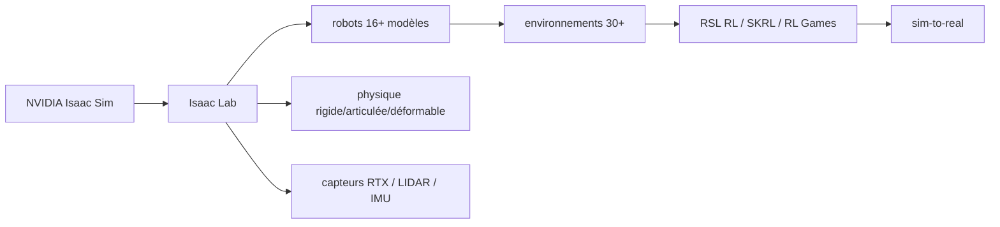

# isaac-sim/IsaacLab

> Framework GPU open source pour la recherche en robotique : RL, imitation, planification de mouvement.

## Le problème
Entraîner une politique de robot en simulation demande d'assembler physique, capteurs et environnements, et le transfert vers le réel échoue si la simulation n'est pas fidèle.

## Ce que ça fait vraiment
Unifie les workflows de recherche robotique — apprentissage par renforcement, imitation, planification — sur NVIDIA Isaac Sim.
Plus de 16 modèles de robots : manipulateurs, quadrupèdes, humanoïdes.
Plus de 30 environnements prêts à entraîner, compatibles RSL RL, SKRL, RL Games et Stable Baselines, multi-agent inclus.
Capteurs simulés : caméras RTX RGB, profondeur et segmentation, LIDAR, IMU, capteurs de contact, ray casters. Corps rigides, systèmes articulés, objets déformables.

## Comment c'est branché

## Essayer
Aucune commande n'est documentée dans le README : il renvoie à la documentation Isaac Lab pour l'installation.

## Coût et pièges
Gratuit mais indissociable d'Isaac Sim, produit NVIDIA, et d'un GPU. Le couplage de versions est strict : la branche `release/3.0.0` exige Isaac Sim 6.1, `main` couvre 4.5, 5.0 et 5.1 — se tromper de branche ne marche pas.

## Ce que ce n'est pas
Pas stable sur cette branche : le README prévient que `release/3.0.0` est en développement actif, avec ruptures, messages d'erreur, et régressions de performance possibles. Pas autonome : sans Isaac Sim, rien ne tourne. Pas un outil de déploiement sur robot réel, seulement d'entraînement en simulation.

## Alternatives
RSL RL, SKRL, RL Games, Stable Baselines — les frameworks RL supportés, pas des substituts à Isaac Lab.

## Pour toi
À surveiller si tu touches au RL robotique ; l'attelage à Isaac Sim et à un GPU NVIDIA en fait un engagement, pas un essai.
