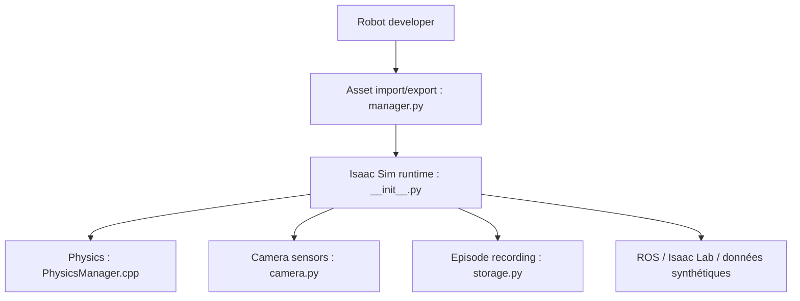

# isaac-sim/IsaacSim

> Plateforme de simulation robotique de NVIDIA, basée sur Omniverse, pour développer, tester et entraîner des robots.

## Le problème
Entraîner et tester des robots demande des environnements simulés réalistes avec capteurs et physique.

## Ce que ça fait vraiment
Importe des robots (URDF, MJCF, CAD), simule la physique sur GPU, fournit des capteurs RTX et physiques, des contrôleurs et la génération de mouvements. S'intègre à ROS, à Isaac Lab (RL, imitation), à la génération de données synthétiques et aux jumeaux numériques. Le dépôt décrit la compilation depuis les sources.

## Comment c'est branché


## Essayer
```bash
git clone -b main https://github.com/isaac-sim/IsaacSim.git isaacsim
cd isaacsim
git lfs install && git lfs pull
./build.sh
cd _build/linux-x86_64/release && ./isaac-sim.sh
```

## Coût et pièges
GPU NVIDIA RTX récent exigé (RTX 4080 minimum). GCC/G++ 11 requis ; accès Internet pour télécharger Kit. Premier lancement long. Licence présente mais non identifiée, acceptation des termes Omniverse au premier build.

## Ce que ce n'est pas
Pas un simulateur léger : lourd en matériel et en dépendances NVIDIA.

## Alternatives
- Isaac Lab : cadre RL/imitation construit sur Isaac Sim, cité par le README.

## Pour toi
À surveiller : pertinent pour la robotique, le RL et les données synthétiques si tu as un GPU NVIDIA RTX ; trop lourd sinon.

