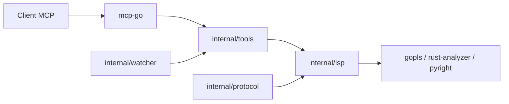

# isaacphi/mcp-language-server

> Serveur MCP qui expose un serveur de langage (LSP) aux LLM : définitions, références, renommage, diagnostics.

## Le problème
Un agent de code qui navigue par recherche textuelle rate le sens : il ne sait pas où un symbole est défini ni qui l'utilise.

## Ce que ça fait vraiment
Un binaire Go lancé avec `--workspace` et `--lsp <serveur>` démarre un vrai serveur de langage (gopls, rust-analyzer, pyright, typescript-language-server, clangd) et traduit ses réponses en outils MCP : `definition`, `references`, `diagnostics`, `hover`, `rename_symbol`, `edit_file`. Le code LSP généré est repris de gopls.

## Comment c'est branché


## Essayer
```bash
go install github.com/isaacphi/mcp-language-server@latest
# puis, dans la config du client MCP :
# "command": "mcp-language-server",
# "args": ["--workspace", "/Users/you/dev/yourproject/", "--lsp", "gopls"]
```

## Coût et pièges
Gratuit. Il faut Go et un serveur de langage installé pour chaque langage, avec les bons `PATH` et variables d'environnement dans la config du client. `LOG_LEVEL=DEBUG` pour diagnostiquer.

## Ce que ce n'est pas
Pas un serveur de langage pour MCP, précise le README. Logiciel bêta de l'aveu de l'auteur. `edit_file` modifie réellement tes fichiers par numéros de ligne.

## Alternatives
Aucune alternative nommée dans le README.

## Pour toi
À surveiller : utile pour donner à un agent de code une navigation sémantique sur du Python (pyright), mais bêta et maintenu par une seule personne.
