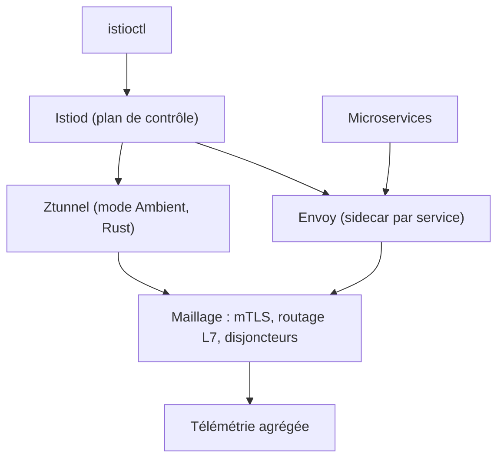

# istio/istio

> Service mesh qui sécurise, connecte et observe des microservices sans toucher leur code.

## Le problème
Chiffrement mutuel, répartition de charge, politiques et télémétrie finissent sinon réimplémentés
dans chaque service, dans chaque langage, avec des comportements divergents.

## Ce que ça fait vraiment
Ajoute une couche d'abstraction au-dessus du gestionnaire de cluster, typiquement Kubernetes,
pour gérer le trafic entre microservices, appliquer des politiques et agréger la télémétrie.
Trois composants : **Envoy**, proxy sidecar par microservice qui traite l'entrée et la sortie et
apporte découverte, routage de niveau 7, disjoncteurs, application de politiques et télémétrie ;
**Ztunnel**, proxy de plan de données léger en Rust utilisé en mode Ambient, sans sidecar ;
**Istiod**, plan de contrôle qui fait la découverte de services, la configuration et la gestion
des certificats.

## Comment c'est branché


## Essayer
```bash
# Aucune commande dans le README : il renvoie à istio.io et au guide du développeur.
```

## Coût et pièges
Gratuit. Le coût réel est opérationnel : un cluster Kubernetes, un sidecar par pod (ou le mode
Ambient pour l'éviter), et une surface de configuration large. Le README prévient que seuls
`istio/api` et `istio/client-go` exposent des interfaces stables utilisables comme bibliothèques.

## Ce que ce n'est pas
Ce n'est pas un réseau overlay : il simplifie la communication sur le réseau existant, il ne le
remplace pas. Ce n'est pas un seul dépôt : le projet est réparti entre istio/api, istio/proxy,
istio/ztunnel, istio/client-go. Ce n'est pas un outil d'application unique.

## Alternatives
Aucune alternative nommée dans le README.

## Pour toi
Hors périmètre sauf si tu exploites toi-même les clusters qui servent tes modèles.
