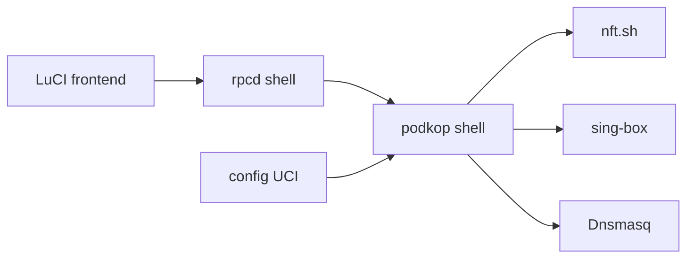

# itdoginfo/podkop

> Paquet OpenWrt de routage de trafic sélectif via un tunnel, basé sur sing-box.

## Le problème
Envoyer certaines destinations dans un tunnel et le reste en direct, depuis le routeur.

## Ce que ça fait vraiment
Un service shell OpenWrt génère la configuration sing-box, manipule nftables, les ensembles de règles et Dnsmasq, avec configuration UCI. Une interface LuCI en TypeScript offre tableau de bord et diagnostics (DNS, FakeIP, nftables, sing-box). Le tableau de bord passe par l'API Clash de sing-box, HTTP seulement.

## Comment c'est branché


## Essayer
```bash
sh <(wget -O - https://raw.githubusercontent.com/itdoginfo/podkop/refs/heads/main/install.sh)
```

## Coût et pièges
Gratuit. OpenWrt 24.10 ou plus, 25 Mo libres (16 Mo de flash non supportés). Modifie Dnsmasq et sing-box à l'exécution. Bêta, PR acceptées après accord sur Telegram. README en russe.

## Ce que ce n'est pas
Pas un VPN clé en main : il faut fournir le tunnel. Pas un outil hors OpenWrt.

## Alternatives
Le README cite Getdomains, à désinstaller avant.

## Pour toi
À ignorer : routage réseau domestique sur routeur, sans lien avec ton travail data, IA ou MLOps.

