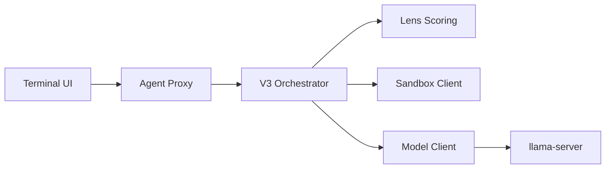

# itigges22/ATLAS

> Agent de code local qui ajoute planification, vérification en bac à sable et réparation autour de petits modèles.

## Le problème
Les petits modèles locaux produisent du code moins fiable que les modèles hébergés, sans vérification ni réparation.

## Ce que ça fait vraiment
Une TUI (Bubbletea) et un proxy Go orchestrent une chaîne V3 : planification (PlanSearch), candidats variés, budget de réflexion, tests auto-générés, boucles de raffinement en bac à sable (Python, Rust, Go, C…). Un « Geometric Lens » note les candidats à partir des embeddings du modèle (MLP et XGBoost). L'inférence passe par llama-server sur GGUF, avec décodage contraint par grammaire. Score de 74,6 % sur LiveCodeBench pour un modèle 14B figé (mesure de l'auteur).

## Comment c'est branché


## Essayer
```bash
curl -fsSL https://raw.githubusercontent.com/itigges22/ATLAS/main/scripts/atlas-bootstrap.sh | bash
atlas
```

## Coût et pièges
16 Go de VRAM minimum, Docker, environ 20 Go de disque, 10 à 30 minutes d'installation. Les commandes du bac à sable ont un accès réseau sortant par défaut. Décodage contraint lent (~51 tok/s).

## Ce que ce n'est pas
Pas encore benchmarké sur les modèles actuels du registre ; les ajouts de fonctionnalités complexes restent inégaux. Licence AGPL-3.0 : obligations de partage en cas d'exposition réseau.

## Alternatives
- Aucune alternative nommée dans le README.

## Pour toi
Surveiller : idée intéressante pour du code 100 % local sur GPU 16 Go, mais AGPL, jeune et peu validé.
