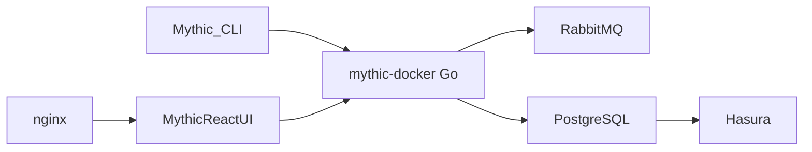

# its-a-feature/Mythic

> Plateforme collaborative de red teaming, pour équipes de sécurité agissant sous mandat d'évaluation autorisé.

## Le problème
Les équipes de red team mènent des exercices à plusieurs opérateurs et doivent coordonner, suivre et rapporter leurs actions dans un même outil.

## Ce que ça fait vraiment
Serveur Go orchestré par docker-compose, interface web React, messagerie RabbitMQ, PostgreSQL et GraphQL via Hasura, avec Grafana et Prometheus. Le dépôt n'héberge aucun agent ni profil de communication : ils s'installent depuis d'autres dépôts GitHub via `mythic-cli`. Le README précise un usage avec autorisation, pour évaluer la posture de sécurité et pour la recherche.

## Comment c'est branché


## Essayer
```bash
sudo make
sudo ./mythic-cli start
sudo ./mythic-cli update
```

## Coût et pièges
Gratuit ; nécessite Docker et des droits root. Licence présente mais non identifiée par GitHub : à lire avant tout usage. Usage légal uniquement dans un cadre contractuel d'évaluation.

## Ce que ce n'est pas
Pas un outil de sécurité défensive ni de MLOps. Le noyau seul ne fait rien sans modules externes installés séparément.

## Alternatives
Aucune alternative nommée dans le README.

## Pour toi
Ignorer : hors du périmètre data/IA/MLOps, et réservé à des équipes offensives mandatées ; licence à clarifier.

