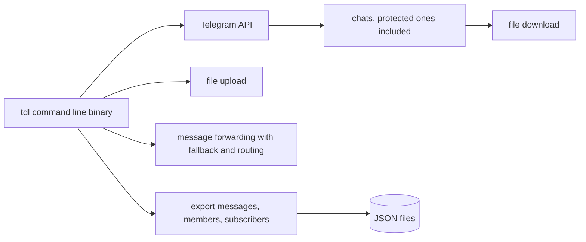

# iyear/tdl

> **A command-line Telegram client to download, upload, forward and export.**

## The problem

Getting files out of Telegram normally means the official client: slow, hard to script, and
blocked on so-called protected chats. Exporting messages, members or subscribers into a usable
format is not offered there either.

## What it actually does

The README advertises a single-file binary, with nothing else to install, which its authors say
uses few resources and takes up the available bandwidth. Four uses are listed: downloading files,
including from protected chats; uploading files to Telegram; forwarding messages with automatic
fallback and message routing; exporting messages, members or subscribers to JSON. The README
states that speed depends on whether the account is premium, and that the demo capture hit a
proxy's own limit. Everything else — flags, subcommands, configuration — is deferred to external
documentation at docs.iyear.me/tdl, which this sheet did not read.

## How it is wired



Drawn from the README alone; no code-derived diagram ships with this repository. One executable
talks to Telegram and acts as the entry point for the four advertised operations; exports land as
JSON. Internal file and module names are not documented here.

## Trying it

```bash
# The README documents no install command and no usage command.
# It points to external documentation: https://docs.iyear.me/tdl/
```

Nothing is reconstructed: the README only mentions single-file start-up and links to its
documentation site.

## Cost and traps

Free, with no API key mentioned in the README, but a Telegram account is required by
construction. The README explicitly says speed depends on premium status, so the advertised
throughput is not guaranteed for an ordinary account. AGPL-3.0, strong copyleft: embedding this
code in an exposed service means publishing your sources. Finally, all real configuration lives
in external documentation, outside the repository read here. Downloading from protected chats may
also conflict with the rules of the rooms involved.

## What it is not

Not a Telegram bot, and not a Go library to import: the README presents a binary you run
yourself. Not an analysis tool either — the JSON export stops at raw output, with nothing said
about processing or indexing. And not a documented way around Telegram's rate limits: the README
concedes that speed depends on the account.

## Alternatives

The README names no competitor. Among the supplied neighbours, only webtorrent/webtorrent touches
file transfer, but over BitTorrent rather than Telegram: the two do not replace each other.
Zie619/n8n-workflows, gulpjs/gulp and semantic-release/semantic-release belong to other domains.
No genuinely comparable alternative in the catalogue.

## For you

Marginal interest for a data / AI / MLOps profile, except in one case: building a corpus from
Telegram rooms, where the JSON export of messages and members is the only scriptable entry point.
Otherwise walk past — and keep the AGPL in mind before turning it into a service.
