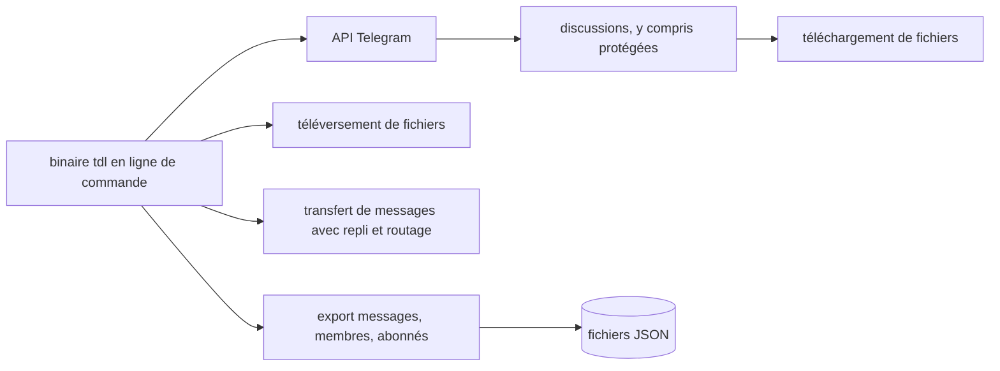

# iyear/tdl

> **Un client Telegram en ligne de commande pour télécharger, téléverser, transférer et exporter.**

## Le problème

Récupérer des fichiers depuis Telegram passe d'ordinaire par le client officiel : lent, peu
scriptable, et bloqué sur les discussions dites protégées. Exporter des messages, des membres
ou des abonnés dans un format exploitable n'y est pas prévu non plus.

## Ce que ça fait vraiment

Le README annonce un binaire unique, sans dépendances à installer, qui d'après ses auteurs
consomme peu de ressources et sature la bande passante disponible. Quatre usages sont listés :
télécharger des fichiers, y compris depuis des discussions protégées ; téléverser des fichiers
vers Telegram ; transférer des messages avec repli automatique et routage des messages ;
exporter messages, membres ou abonnés en JSON. Le README précise que la vitesse dépend du
statut premium du compte, et que la capture de démonstration atteignait la limite d'un proxy.
Tout le reste — options, sous-commandes, configuration — est renvoyé vers une documentation
externe (docs.iyear.me/tdl) que cette fiche n'a pas lue.

## Comment c'est branché



Schéma déduit du seul README, aucun diagramme tiré du code n'accompagne ce dépôt. Un exécutable
unique parle à Telegram et sert de point d'entrée aux quatre opérations annoncées ; les exports
sortent en JSON. Les noms de fichiers et de modules internes ne sont pas documentés ici.

## Essayer

```bash
# Le README ne documente aucune commande d'installation ni d'utilisation.
# Il renvoie à la documentation externe : https://docs.iyear.me/tdl/
```

Rien n'est reconstruit : le README se contente de mentionner un démarrage par fichier unique
et pointe vers son site de documentation.

## Coût et pièges

Gratuit et sans clé d'API mentionnée dans le README, mais un compte Telegram est nécessaire par
construction. Le README indique explicitement que la vitesse dépend du statut premium du compte :
le débit annoncé n'est donc pas garanti pour un compte ordinaire. Licence AGPL-3.0, copyleft fort :
intégrer ce code dans un service exposé oblige à en publier les sources. Enfin, toute la
configuration réelle vit dans une documentation externe, hors du dépôt lu ici. Télécharger depuis
des discussions protégées peut par ailleurs heurter les règles des salons concernés.

## Ce que ce n'est pas

Ce n'est pas un bot Telegram ni une bibliothèque Go à importer : le README présente un binaire
à lancer soi-même. Ce n'est pas non plus un outil d'analyse — l'export JSON s'arrête à la
sortie brute, rien n'est dit d'un traitement ou d'une indexation. Et ce n'est pas un
contournement documenté des limites de débit de Telegram : le README reconnaît que la vitesse
dépend du compte.

## Alternatives

Le README ne nomme aucun concurrent. Parmi les voisins fournis, seul webtorrent/webtorrent
touche au transfert de fichiers, mais sur BitTorrent et non sur Telegram : les deux ne se
remplacent pas. Zie619/n8n-workflows, gulpjs/gulp et semantic-release/semantic-release relèvent
d'autres domaines. Aucune alternative réellement comparable dans le catalogue.

## Pour toi

Intérêt marginal pour un profil data / IA / MLOps, sauf cas précis : constituer un corpus depuis
des salons Telegram, l'export JSON des messages et des membres étant alors le seul point
d'entrée scriptable. Sinon, passer son chemin — et garder en tête l'AGPL avant d'en tirer un
service.
