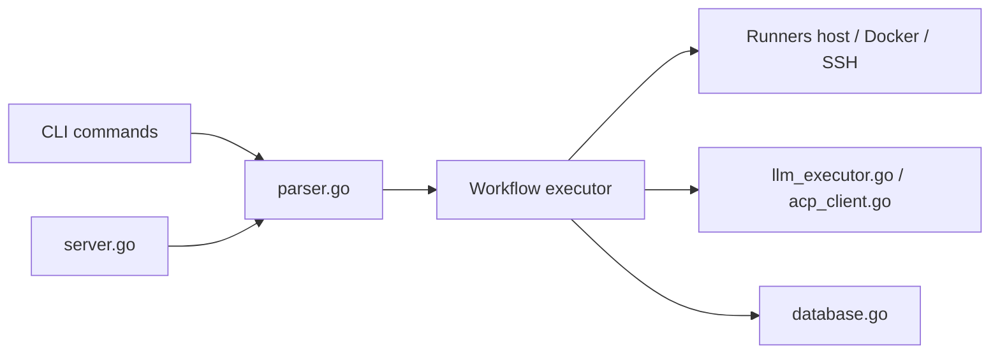

# j3ssie/osmedeus

> Moteur d'orchestration de workflows YAML pour automatiser des tâches de sécurité, destiné aux équipes autorisées.

## Le problème
Les tâches de sécurité (reconnaissance, scans, tri) s'enchaînent en scripts ad hoc, difficiles à relire, à distribuer et à rejouer.

## Ce que ça fait vraiment
- Des workflows déclaratifs en YAML (modules et flows) avec hooks, branches conditionnelles et exclusion de modules ; exécution sur l'hôte, en Docker ou en SSH.
- Exécution distribuée par file Redis maître/workers, planification (cron, surveillance de fichiers, événements) et plus de 80 fonctions utilitaires.
- Étapes LLM et agents (dont des agents ACP comme Claude Code, Codex, Gemini), et provisionnement cloud (DigitalOcean, AWS, GCP, Linode, Azure).
- API REST et tableau de bord intégré ; résultats stockés en base pour requêtes (`osmedeus query vulns`).

## Comment c'est branché


## Essayer
```bash
curl -sSL http://www.osmedeus.org/install.sh | bash
npm install -g @j3ssie/osmedeus
osmedeus run -m recon -t example.com --dry-run
osmedeus workflow list
osmedeus serve
```

## Coût et pièges
Gratuit ; les clés d'API LLM et le cloud sont à ta charge. Le README prévient que l'outil exécute volontairement du code arbitraire issu des workflows : relire tout YAML tiers avant de le lancer.

## Ce que ce n'est pas
Ce n'est pas un scanner clé en main : c'est un orchestrateur qui s'appuie sur d'autres outils. À ne lancer que sur des cibles dont tu es propriétaire ou pour lesquelles tu as une autorisation de test.

## Alternatives
Aucune alternative nommée dans le README.

## Pour toi
Surveiller : l'orchestration YAML distribuée avec agents LLM est instructive pour un profil MLOps, mais l'usage sécurité offensive n'est pertinent que dans un cadre autorisé.

