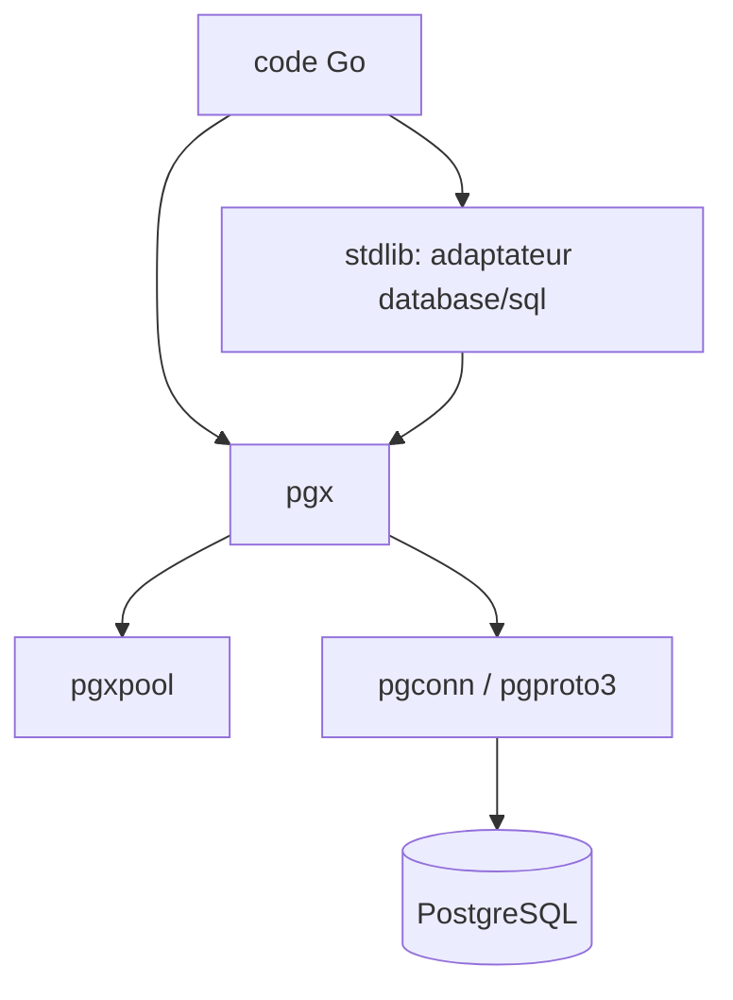

# jackc/pgx

> Pilote PostgreSQL et boîte à outils en Go pur, pour développeurs Go ciblant PostgreSQL.

## Le problème
L'interface `database/sql` de Go masque les fonctionnalités propres à PostgreSQL.
Pas de `LISTEN`/`NOTIFY`, pas de `COPY`, pas de format binaire pour les types personnalisés.

## Ce que ça fait vraiment
pgx est une interface bas niveau qui expose les fonctionnalités spécifiques à PostgreSQL, avec un
adaptateur `database/sql` pour la compatibilité. Il gère ~70 types PostgreSQL, la préparation et
le cache automatiques des requêtes, les requêtes par lot, le mode aller-retour unique, le contrôle
TLS complet, `COPY`, `json`/`jsonb`, `hstore`, les objets larges, et les transactions imbriquées
simulées par savepoints. Les paquets sous-jacents (protocole filaire, mapping de types) servent à
écrire d'autres pilotes, proxies ou clients de réplication logique.

## Comment c'est branché


## Essayer
```bash
go get github.com/jackc/pgx/v5
```

## Coût et pièges
Gratuit. Il faut une instance PostgreSQL. Le développement local monte des clusters PostgreSQL
14-18 et un nœud CockroachDB par checkout, via `scripts/setup-host`, `mise` et `./test.sh` — lourd
si tu veux juste contribuer ; CONTRIBUTING.md décrit comment tester contre un serveur existant.

## Ce que ce n'est pas
Ce n'est pas un ORM ni un mapper : le README recommande `scany`, `ksql`, `pmx` ou `stephenafamo/scan`
pour le scan vers des structs. Ce n'est pas utile si tu vises plusieurs SGBD ou si une autre
bibliothèque t'impose `database/sql`.

## Alternatives
- `github.com/vingarcia/ksql` : client SQL conçu pour rendre SQL plus productif en Go.
- `github.com/pashagolub/pgxmock` : simuler pgx en test sans base réelle.
- `github.com/jackc/tern` : système de migration SQL autonome, si c'est la migration qui t'intéresse.

## Pour toi
Le choix par défaut dès qu'un service Go de ta stack data parle à PostgreSQL et que tu veux `COPY`
pour les chargements en masse.
