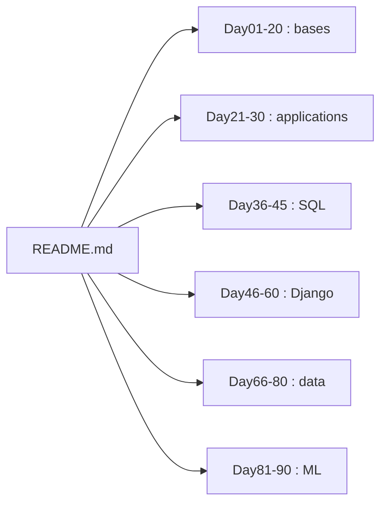

# jackfrued/Python-100-Days

> Cours en chinois de Python sur 100 jours, des bases à Django, l'analyse de données et le machine learning.

## Le problème
Un débutant qui veut apprendre Python de bout en bout a du mal à trouver un plan cohérent, du langage jusqu'au déploiement et à la data science.

## Ce que ça fait vraiment
Un plan jour par jour : Day01–20 bases (variables, structures, fonctions, POO), Day21–30 fichiers, CSV, Excel, PDF, images, regex, Day36–45 bases de données et SQL, Day46–60 Django, Day61–65 collecte web, Day66–80 NumPy, pandas et visualisation, Day81–90 machine learning, Day91–99 projet d'équipe. Le contenu est en chinois. Le README évoque aussi une offre payante (groupe d'entraide sur WeChat) et des colonnes Zhihu.

## Comment c'est branché


## Essayer
Commandes présentes dans le README (jour 91, projet Django) :
```bash
python manage.py makemigrations app
python manage.py migrate
python manage.py inspectdb > app/models.py
```

## Coût et pièges
Gratuit pour la lecture ; un groupe de suivi payant est proposé par l'auteur. Le graphe d'architecture décrit un pipeline (Hexo, CI, CDN) que le graphe lui-même dit supposer faute de fichiers de build : non retenu ici. Aucune licence déclarée, donc pas de droit de réutilisation.

## Ce que ce n'est pas
Ni une bibliothèque ni un parcours data/IA spécialisé : la partie ML est une introduction en 10 jours. Le dépôt n'est pas un site publié.

## Alternatives
Aucune alternative nommée dans le README.

## Pour toi
À ignorer : cours généraliste en chinois, sans licence, avec un volet data/ML introductif ; mieux vaut un support de ML actuel en français ou en anglais.

