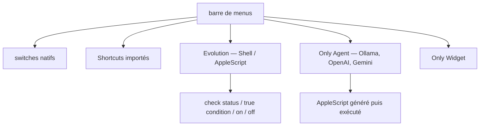

# jacklandrin/OnlySwitch

> Application de barre de menus macOS regroupant une cinquantaine d'interrupteurs système.

## Le problème
Masquer les icônes du bureau, basculer en mode sombre, couper le micro ou cacher l'encoche demandent chacun un réglage enfoui ou une app dédiée.
Multiplier les petites apps de menubar sature justement la barre de menus.

## Ce que ça fait vraiment
Une liste d'interrupteurs natifs — mode sombre, Night Shift, Bluetooth, Keep awake, cache d'Xcode, vider la corbeille, minuterie Pomodoro, radio — activables au clavier depuis la barre.
« Evolution » laisse créer ses propres interrupteurs en Shell ou AppleScript, avec script de vérification d'état, condition vraie, allumage et extinction, tous testables avant enregistrement.
Des Shortcuts macOS peuvent être importés, et depuis la 2.5.0 tout cela se pose aussi en widgets Apple.
« Only Agent » génère un AppleScript depuis une demande en anglais via Ollama, OpenAI ou Gemini, et l'exécute immédiatement si le mode agent est actif.

## Comment c'est branché


## Essayer
```bash
brew install only-switch
```

## Coût et pièges
Gratuit. « Low Power Mode » passe par des commandes root et redemande le mot de passe à chaque bascule ; Only Agent exige macOS 26.0+ et une clé OpenAI ou Gemini si tu n'utilises pas Ollama.
Sur macOS 27, le masquage d'icônes s'appuie sur une API privée, incompatible Mac App Store et cassable par une mise à jour système.

## Ce que ce n'est pas
Ce n'est pas multiplateforme : macOS uniquement. Ce n'est pas stable partout — « Hide notch », « Hide Windows » et « Top Sticker » sont marqués partiellement finis ou à problèmes.
L'agent IA n'est pas un assistant : il fabrique un AppleScript et le lance, sans garde-fou décrit.

## Alternatives
- Hidden : cité comme l'origine de l'idée de masquer les icônes, si c'est ton seul besoin.
- Dozer : mentionné à côté de Hidden pour la même fonction.
- SpotMenu : référence citée pour le contrôle Spotify / Apple Music seul.

## Pour toi
Hors périmètre data/IA : un confort de poste macOS, avec un agent AppleScript qui exécute sans filet.
