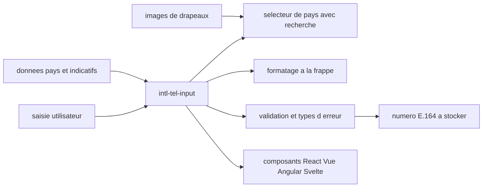

# jackocnr/intl-tel-input

> **An international phone number input field, for any web front end that collects a number.**

## The problem

Without it, every form rebuilds the same country picker, dial-code handling, as-you-type
formatting and validation — and ends up storing inconsistent numbers that no SMS provider will
take as-is. The README frames the need plainly: entering, formatting and validating
international telephone numbers.

## What it actually does

The README claims four concrete things. A country picker searchable by country name or dial
code, with full keyboard navigation. Smart defaults: auto-detection of the user's country and a
per-country example placeholder. Formatting of the number as the user types, plus extraction of
a standard E.164 number to store. Validation with specific error types, the option to only allow
valid digits, and enforcement of a maximum length. On top of that: translations into 50+
languages, RTL and alternative numerals, screen-reader ARIA markup, theming through CSS
variables or utility classes, and bundled TypeScript definitions.

## How it is wired



The README describes no source layout, so the diagram only shows the pieces it names. The core
is a vanilla JavaScript library, also shipped as React, Vue, Angular and Svelte components. It
leans on three credited external sources: flag images from `lipis/flag-icons`, original country
data from `mledoze/countries`, and formatting, validation and example-number code from
`googlei18n/libphonenumber`. The output a back end cares about is the E.164 number.

## Trying it

```text
# The README documents no install command and no usage snippet.
# It points to intl-tel-input.com: integration docs, a live playground and examples.
```

Nothing is reconstructed here: there is neither an `npm install` line nor a code sample in the
README, and getting started happens entirely on the external site.

## Cost and traps

MIT licensed, free, no API key and nothing to pay. The trap is documentation dependency:
everything you need to actually use it — options, integrations, validation examples — lives on
`intl-tel-input.com`, not in the repository. Second point: browser support is bounded at
Chrome/Edge 93+, Safari 15.4+, Firefox 92+, roughly anything released since early 2022, with
older browsers sent to an FAQ. Finally the project is sponsored by Twilio, featured at the top
of the README; that imposes no third-party service, but it explains the SMS-verification slant
of the framing.

## What it is not

It is not an SMS sending or verification service: the library stops at the input field and the
E.164 number it produces. It is not an independent validation engine either — formatting and
validation come from libphonenumber, of which this is the front-end wrapper. And it does not
check that a number really exists: the README speaks of numbers valid against the numbering
plan, not of reachable lines.

## Alternatives

`googlei18n/libphonenumber`, credited in the README: prefer it when you only need formatting and
validation server-side, with no UI component. None of the other catalogue neighbours
(codesandbox-client, win11React, worklenz, phoenix) is comparable — they are web applications,
not phone input fields.

## For you

Little direct bearing on a data / AI / MLOps role, unless you build the interface that collects
numbers upstream of a pipeline: there, getting clean E.164 at entry saves expensive cleanup
later. Otherwise, worth knowing and filing away, not worth exploring.
