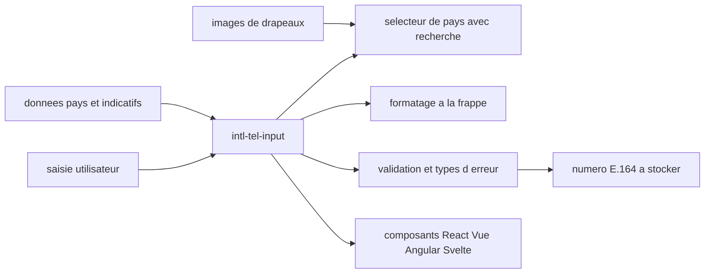

# jackocnr/intl-tel-input

> **Champ de saisie de numéro de téléphone international, pour tout front web qui collecte un numéro.**

## Le problème

Sans lui, chaque formulaire réinvente le sélecteur de pays, l'indicatif, le formatage à la frappe
et la validation — et finit par stocker des numéros hétérogènes qu'aucun service d'envoi de SMS
n'accepte tels quels. Le README pose le besoin ainsi : saisir, formater et valider des numéros
internationaux.

## Ce que ça fait vraiment

Le README annonce quatre choses concrètes. Un sélecteur de pays avec recherche par nom ou par
indicatif et navigation complète au clavier. Des valeurs par défaut déduites : détection du pays
de l'utilisateur, placeholder d'exemple propre à chaque pays. Un formatage du numéro pendant la
frappe, et l'extraction d'un numéro E.164 standard à stocker. Une validation avec des types
d'erreur distincts, la possibilité de n'autoriser que des chiffres valides et d'imposer une
longueur maximale. S'y ajoutent plus de 50 langues de traduction, le support RTL et des
numéraux alternatifs, un balisage ARIA pour lecteurs d'écran, un thème pilotable par variables
CSS ou classes utilitaires, et des définitions TypeScript livrées avec le paquet.

## Comment c'est branché



Le README ne décrit pas l'arborescence du code : ce schéma reprend uniquement les pièces qu'il
nomme. Le cœur est une bibliothèque JavaScript vanilla, disponible aussi sous forme de composants
React, Vue, Angular et Svelte. Elle s'appuie sur trois sources externes citées en attributions :
les drapeaux viennent de `lipis/flag-icons`, les données pays d'origine de `mledoze/countries`,
et le code de formatage, de validation et de numéros d'exemple de `googlei18n/libphonenumber`.
La sortie utile pour le back-end est le numéro E.164.

## Essayer

```text
# Le README ne documente aucune commande d'installation ni d'usage.
# Il renvoie au site intl-tel-input.com : docs d'intégration, playground et exemples.
```

Rien n'est reconstruit ici : il n'y a ni `npm install` ni extrait de code dans le README, la
prise en main passe entièrement par le site externe.

## Coût et pièges

Licence MIT, gratuit, rien à payer ni aucune clé d'API. Le piège n'est pas le prix mais la
dépendance documentaire : tout ce qui permet réellement de s'en servir — options, intégrations,
exemples de validation — vit sur `intl-tel-input.com` et non dans le dépôt. Second point : le
support navigateur est borné à Chrome/Edge 93+, Safari 15.4+, Firefox 92+, soit grosso modo tout
ce qui est sorti depuis début 2022 ; en dessous, le README renvoie à une FAQ. Enfin le projet
est sponsorisé par Twilio, qui est mis en avant en haut du README — cela n'impose aucun service
tiers, mais l'orientation « vérification par SMS » du discours vient de là.

## Ce que ce n'est pas

Ce n'est pas un service d'envoi ni de vérification de SMS : la bibliothèque s'arrête au champ de
saisie et au numéro E.164 produit. Ce n'est pas non plus un moteur de validation indépendant —
le formatage et la validation viennent de libphonenumber, dont elle est l'habillage front. Et ce
n'est pas une validation de l'existence réelle du numéro : le README parle de numéros valides au
sens du plan de numérotation, pas de lignes joignables.

## Alternatives

`googlei18n/libphonenumber`, cité en attributions : à préférer si l'on veut seulement formater
et valider côté serveur, sans composant d'interface. Aucun autre voisin proposé par le catalogue
(codesandbox-client, win11React, worklenz, phoenix) n'est comparable : ce sont des applications
web, pas des champs de saisie téléphonique.

## Pour toi

Peu de rapport direct avec un poste data / IA / MLOps, sauf si tu construis l'interface qui
collecte des numéros en amont d'un pipeline : dans ce cas, obtenir du E.164 propre dès la saisie
t'épargne un nettoyage coûteux plus loin. Sinon, à connaître et à ranger, pas à explorer.
