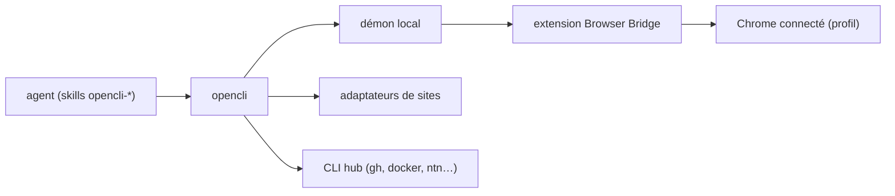

# jackwener/OpenCLI

> Transforme des sites web en commandes CLI déterministes pilotables par un agent.

## Le problème
Scraper un site connecté impose de gérer cookies, sessions et anti-bot pour chaque page.
Un agent qui « clique » via captures d'écran est lent, coûteux et non reproductible.

## Ce que ça fait vraiment
Des adaptateurs intégrés exposent 100+ sites (Reddit, HackerNews, Twitter, LinkedIn, Bilibili…) en sous-commandes.
Une extension Chrome (Browser Bridge) plus un démon local pilotent ton Chrome déjà connecté.
`opencli browser` fournit les primitives brutes : `open`, `state`, `click`, `type`, `extract`, `network`, `eval`…
Six skills installables donnent ces primitives à Claude Code ou Cursor ; il sert aussi de hub pour `gh`, `docker`, `tg`, Notion.

## Comment c'est branché


## Essayer
```bash
npm install -g @jackwener/opencli
opencli doctor
opencli list
opencli hackernews top --limit 5
npx skills add jackwener/opencli
opencli bilibili hot -f json
```

## Coût et pièges
Node ≥ 20.18.1 ; l'extension s'installe depuis le Chrome Web Store ou en mode développeur.
L'agent agit avec **ta** session connectée : publier, suivre, envoyer des messages sont des commandes disponibles.

## Ce que ce n'est pas
Ce n'est pas une API officielle des sites couverts : les adaptateurs cassent quand le site change (d'où le skill `opencli-autofix`).
Ce n'est pas sans risque de compte : automatiser LinkedIn, Xiaohongshu ou Twitter avec ses identifiants engage l'utilisateur.
Le README ne déclare pas de licence et le projet repose sur un seul mainteneur.

## Alternatives
Aucune alternative nommée dans le README ; seulement des plugins communautaires (github-trending, juejin, vk).

## Pour toi
Curiosité utile pour automatiser une veille sur des sites sans API — à cantonner à un profil Chrome dédié.
