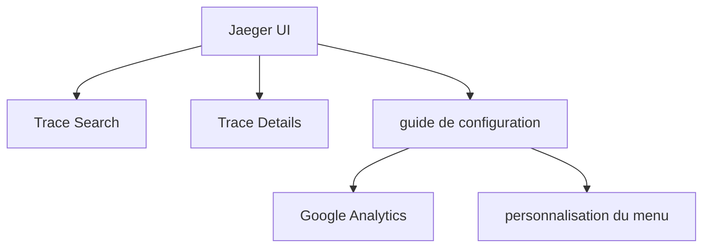

# jaegertracing/jaeger-ui

> Interface web de Jaeger pour visualiser des traces distribuées.

## Le problème
Non documenté : le README ne décrit pas le problème résolu.

## Ce que ça fait vraiment
Le README tient en trois lignes. Il indique deux vues — recherche de traces et détail d'une trace — et renvoie à un guide de configuration.
Ce guide couvre le suivi Google Analytics, la personnalisation du menu et d'autres aspects du comportement de l'interface.
Rien d'autre n'est documenté ici : ni installation, ni dépendances, ni API.

## Comment c'est branché

## Essayer
Aucune commande documentée dans ce README.

## Coût et pièges
Non documenté. Le seul point signalé est la possibilité de configurer un suivi Google Analytics, donc à vérifier avant déploiement.

## Ce que ce n'est pas
Ce n'est pas Jaeger : c'est uniquement la partie interface, qui suppose un backend Jaeger déjà en place.
Le README ne permet pas de savoir comment la construire ou la déployer seule.

## Alternatives
Aucune alternative nommée dans le README.

## Pour toi
Rien à décider ici : si tu utilises déjà Jaeger, cette interface en fait partie ; sinon, ce README n'apporte rien.
