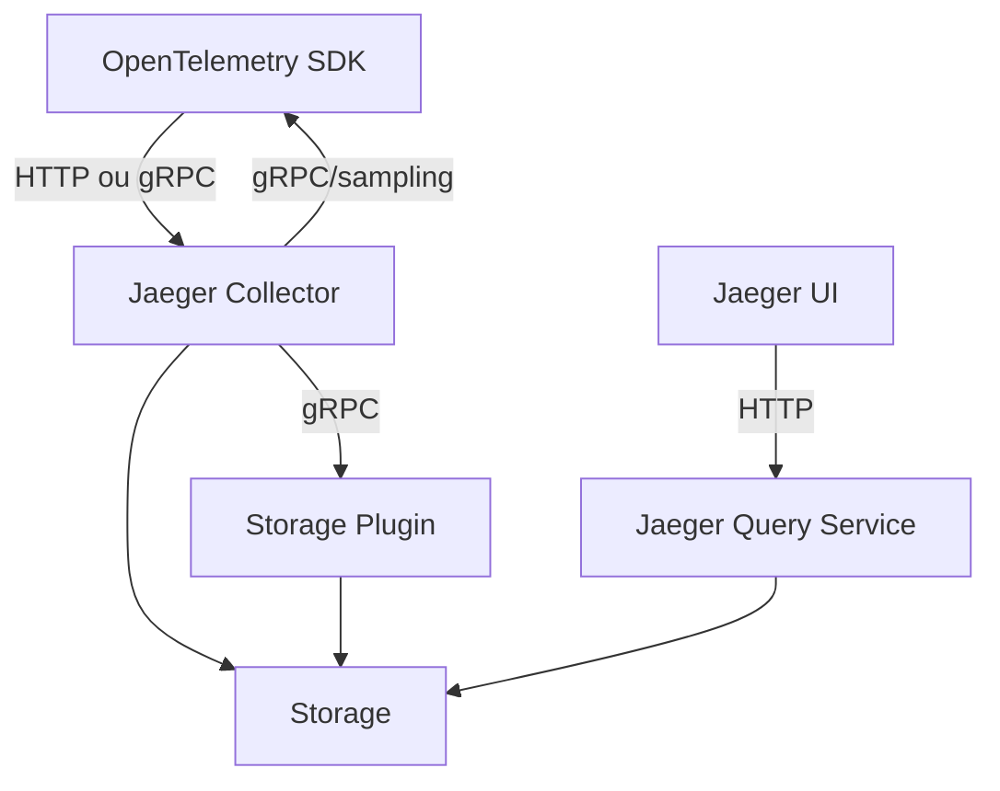

# jaegertracing/jaeger

> Plateforme de traçage distribué, projet gradué CNCF, pour diagnostiquer des chaînes de services.

## Le problème
Quand une requête traverse huit services, les journaux de chacun ne disent pas où le temps est passé
ni lequel a échoué le premier.

## Ce que ça fait vraiment
Un collecteur reçoit les traces en OTLP (gRPC sur 4317, HTTP sur 4318), les écrit dans un stockage
(direct ou via un plugin gRPC), et renvoie la configuration d'échantillonnage aux SDK. Un service
Query lit le stockage et alimente l'UI sur le port 16686. L'image « all-in-one » réunit UI, collector,
query et stockage en mémoire. La v2 est sortie et reprend des composants de l'OpenTelemetry Collector.

## Comment c'est branché


## Essayer
```bash
docker run --rm --name jaeger \
  -p 16686:16686 \
  -p 4317:4317 \
  -p 4318:4318 \
  jaegertracing/jaeger:latest
```

## Coût et pièges
Gratuit, mais le stockage par défaut de l'image all-in-one est en mémoire : tout disparaît à l'arrêt.
Une option de configuration dépréciée bénéficie d'au moins 3 mois ou deux versions mineures avant
suppression ; le support d'une version mineure de Go `N-1` saute dès la sortie de `N`.

## Ce que ce n'est pas
Pas un collecteur de métriques ni de journaux : ce sont des traces. Pas une instrumentation —
il faut des SDK OpenTelemetry dans les services. L'image all-in-one n'est pas une configuration de
production ; le README renvoie au guide de démarrage pour cela.

## Alternatives
- OpenTelemetry Collector : dont Jaeger v2 reprend des composants.

## Pour toi
Le traceur à poser d'office devant un pipeline d'inférence multi-services, avant d'optimiser à l'aveugle.
