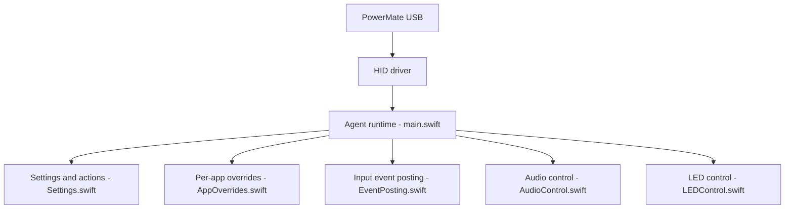

# jameslockman/Griffin-PowerMate-Driver

> Pilote macOS pour faire fonctionner le bouton rotatif Griffin PowerMate (scroll, volume, touches), pour qui en possède un.

## Le problème
Le PowerMate est reconnu sur le bus USB mais ne fait rien par défaut sur macOS moderne.

## Ce que ça fait vraiment
Une bibliothèque Swift lit les rapports HID de 6 octets (bouton, rotation) et un agent de barre de menus, PowerMate Agent, les traduit en défilement, volume système, touches configurables, clics, double-clic, appui long (dont script shell). Des réglages par application existent, et la LED suit l'amplitude audio via `AudioHardwareCreateProcessTap`.

## Comment c'est branché


## Essayer
```bash
brew tap jameslockman/tap
brew install --cask griffin-powermate-agent
swift build
swift run PowerMateAgent
```

## Coût et pièges
Gratuit, mais il faut le matériel PowerMate. macOS 13+, Swift 5.9+. Permissions Accessibilité, Audio Capture et Input Monitoring à accorder. Aucune licence déclarée au catalogue : réutilisation juridiquement floue.

## Ce que ce n'est pas
Ce n'est pas un pilote noyau ni un outil multiplateforme : macOS seulement. Le README mentionne `/path/to/USB` comme nom de dossier, vestige du développement.

## Alternatives
Le README cite le pilote PowerMate pour Linux, sans le nommer comme dépôt.

## Pour toi
À ignorer : utile seulement si tu as un PowerMate sous macOS, sans lien avec ton travail data/IA/MLOps.

