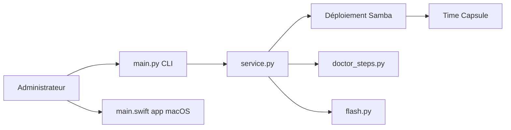

# jamesyc/TimeCapsuleSMB

> Installe Samba 4 directement sur une Apple Time Capsule pour la rendre compatible avec macOS 27.

## Le problème
Les Time Capsules ne parlent qu'AFP et SMB1, retirés des macOS récents, ce qui casse les sauvegardes Time Machine.

## Ce que ça fait vraiment
Déploie par SSH un binaire Samba 4.25 statique (fork modifié pour NetBSD) sur l'appareil. Il annonce SMB par Bonjour, copie le runtime en RAM au démarrage et sert les disques HFS+. Sur les modèles NetBSD 4, un patch de firmware assure le démarrage auto. Application macOS ou CLI `tcapsule` (deploy, doctor, flash, activate).

## Comment c'est branché


## Essayer
```bash
./tcapsule bootstrap
.venv/bin/tcapsule configure
.venv/bin/tcapsule deploy
.venv/bin/tcapsule doctor
```

## Coût et pièges
Gratuit. Modifier le firmware peut rendre l'appareil inutilisable ; des réinitialisations pendant le déploiement sont signalées. L'accès SMB est mappé sur root. Le README dit que les commandes ont une télémétrie activée par défaut.

## Ce que ce n'est pas
Ne doit pas être exposé sur Internet. Disques HFS+ uniquement, pas FAT32.

## Alternatives
Aucune alternative citée dans le README.

## Pour toi
À ignorer : utile seulement si tu possèdes une Time Capsule, hors périmètre data/IA, avec télémétrie et modification de firmware.

