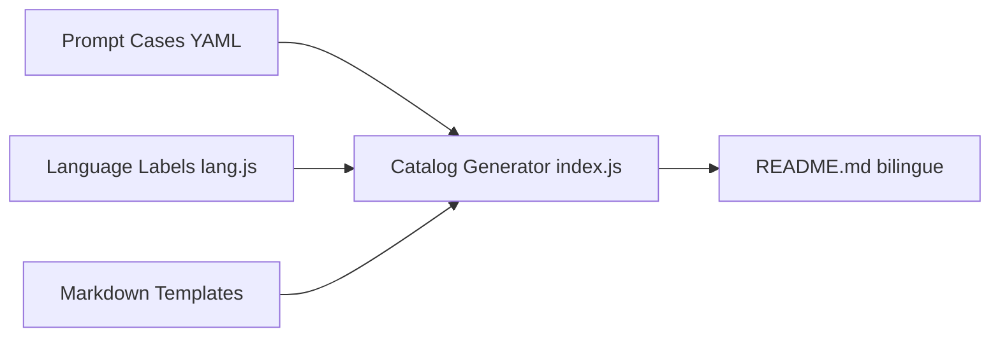

# jamez-bondos/awesome-gpt4o-images

> Collection de 100 cas de prompts et d'images générés avec GPT-4o et gpt-image-1, avec attributions.

## Le problème
Les bons prompts d'image sont dispersés sur X/Twitter et Sora, sans trace ni traduction.

## Ce que ça fait vraiment
Un README bilingue liste 100 cas numérotés : prompt, exemple d'image, auteur et parfois la photo de référence à fournir. Un générateur Node (`index.js`, `lang.js`) lit des YAML et des gabarits Markdown pour produire les README. Les images sont sous CC BY 4.0.

## Comment c'est branché

## Essayer
Aucune commande documentée : ouvrir le README et copier un prompt dans ChatGPT, Sora ou l'API gpt-image-1.

## Coût et pièges
L'usage de ChatGPT/Sora/API est payant ou limité ; certains prompts nécessitent des images de référence et peuvent déclencher la modération.

## Ce que ce n'est pas
Pas un outil de génération. Dernier push en mai 2025 : le contenu n'est plus suivi.

## Alternatives
Aucune alternative nommée dans le README.

## Pour toi
À ignorer : galerie d'inspiration créative, peu transférable en data/MLOps et figée depuis plus d'un an.

