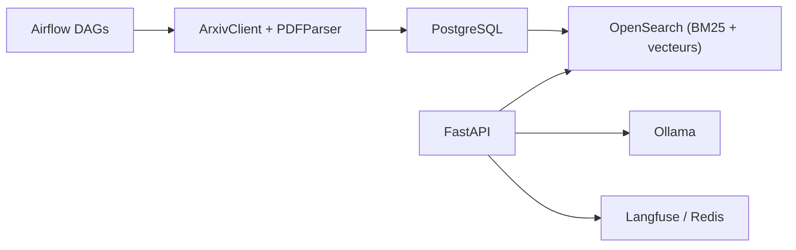

# jamwithai/arxiv-paper-curator

> Cours en sept semaines pour bâtir un assistant de recherche RAG sur les articles arXiv, de la recherche par mots-clés à l'agent.

## Le problème
Les tutoriels RAG sautent les fondations ; on ne voit ni ingestion, ni recherche par mots-clés, ni supervision en production.

## Ce que ça fait vraiment
Un projet FastAPI avec PostgreSQL, OpenSearch, Airflow et Ollama : récupération des articles arXiv, analyse des PDF avec Docling, recherche BM25, découpage et recherche hybride (embeddings Jina, fusion RRF), réponses avec LLM local en flux, traçage Langfuse, cache Redis, puis un flux agentique LangGraph avec notation de documents, réécriture de requête et bot Telegram. Chaque semaine a un notebook et un tag de code.

## Comment c'est branché


## Essayer
```bash
cp .env.example .env
uv sync
docker compose up --build -d
curl http://localhost:8000/api/v1/health
make start
```

## Coût et pièges
Le cours est gratuit ; il faut au moins 8 Go de RAM, 20 Go de disque, une clé Jina (semaine 4+), un jeton Telegram (semaine 7), et environ 2 à 5 dollars si des API de LLM externes sont utilisées.

## Ce que ce n'est pas
Pas une bibliothèque RAG réutilisable : c'est un support pédagogique de bout en bout.

## Alternatives
Aucune alternative nommée dans le README.

## Pour toi
À adopter pour apprendre un RAG complet et observable (hybride, cache, agent) : MIT, projet concret et proche de la production.

