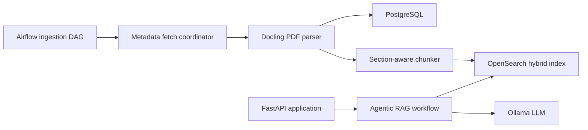

# jamwithai/production-agentic-rag-course

> Cours en sept semaines qui construit un assistant RAG agentique sur les articles arXiv, pile complète Docker.

## Le problème
Les tutoriels RAG sautent directement au vectoriel et ignorent ingestion planifiée, recherche lexicale, observabilité et cache, indispensables en vrai.

## Ce que ça fait vraiment
Chaque semaine ajoute une couche et un tag git : infra (FastAPI, PostgreSQL, OpenSearch, Airflow, Ollama), ingestion arXiv et parsing PDF Docling, BM25, découpage par sections et recherche hybride RRF avec embeddings Jina, RAG avec streaming et interface Gradio, traçage Langfuse et cache Redis, puis RAG agentique LangGraph (garde-fous, notation de documents, réécriture de requêtes) et bot Telegram.

## Comment c'est branché


## Essayer
```bash
cp .env.example .env
uv sync
docker compose up --build -d
curl http://localhost:8000/api/v1/health
uv run jupyter notebook notebooks/week1/week1_setup.ipynb
make start
```

## Coût et pièges
8 Go de RAM et 20 Go de disque minimum. Clé Jina requise dès la semaine 4, clés Langfuse et token Telegram selon les semaines. L'URL de clonage est laissée en `<repository-url>`.

## Ce que ce n'est pas
Pas un produit à déployer tel quel : c'est un parcours pédagogique, dont les promesses « production-grade » tiennent du discours.

## Alternatives
Aucune alternative nommée dans le README.

## Pour toi
À adopter comme parcours de formation : il assemble exactement la pile qu'un AI engineer rencontre (Airflow, OpenSearch hybride, Langfuse, LangGraph) avec un tag par étape, idéal pour progresser ou former une équipe.
