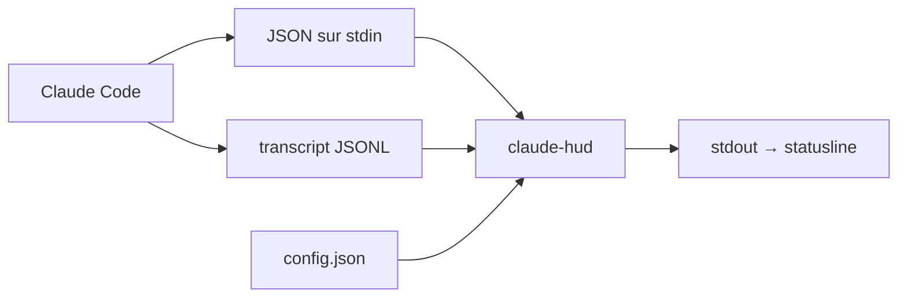

# jarrodwatts/claude-hud

> Barre d'état pour Claude Code : contexte, outils, sous-agents et todos sous le prompt.

## Le problème
On découvre la saturation du contexte quand la compaction se déclenche, trop tard.
Ce que fait l'agent — quels fichiers, quels sous-agents, où il en est — reste invisible entre deux réponses.

## Ce que ça fait vraiment
Utilise l'API statusline native : pas de fenêtre séparée, pas de tmux, fonctionne dans n'importe quel terminal.
Ligne 1 : modèle, fournisseur détecté, chemin projet, branche git. Ligne 2 : barre de contexte et consommation de quota.
Lignes optionnelles : activité des outils, sous-agents en cours avec durée, avancement des todos.
Données de tokens natives (non estimées), expiration du cache de prompt en heure murale, coût du jour, plus de soixante options.

## Comment c'est branché


## Essayer
```bash
claude plugin marketplace add jarrodwatts/claude-hud
claude plugin install claude-hud@claude-hud
mkdir -p ~/.cache/tmp && TMPDIR=~/.cache/tmp claude
winget install OpenJS.NodeJS.LTS
```

## Coût et pièges
Gratuit ; sous Windows, Node.js LTS est le runtime attendu par l'installateur.
Le coût affiché reste masqué pour Bedrock et Vertex sauf option explicite, ces fournisseurs pouvant rapporter `$0.00`.

## Ce que ce n'est pas
Ce n'est pas un suivi de facturation fiable : champ natif quand il existe, estimation locale sinon, et comptabilisé par machine.
La mémoire affichée est la RAM système approximative, pas la pression mémoire réelle de Claude Code.
Le README fourni ici est tronqué au milieu de la section sur les limites d'usage.

## Alternatives
Aucune alternative nommée dans le README.

## Pour toi
Confort réel quand tu enchaînes de longues sessions : la barre de contexte évite les compactions subies.
