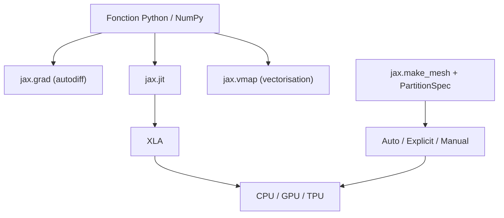

# jax-ml/jax

> Bibliothèque Python de calcul sur accélérateurs, par transformations composables de fonctions.

## Le problème
Dériver, compiler et vectoriser du code numérique NumPy demande sinon trois outils distincts, et
passer à mille accélérateurs impose une réécriture.

## Ce que ça fait vraiment
Différentie automatiquement des fonctions Python et NumPy natives, à travers boucles, branches,
récursion et fermetures, et prend des dérivées de dérivées à n'importe quel ordre.
Supporte le mode inverse via `jax.grad` et le mode direct, composables arbitrairement.
Compile via XLA sur TPU, GPU et autres accélérateurs avec `jax.jit` ; compilation et différentiation
se composent librement. `jax.vmap` mappe une fonction le long d'un axe en poussant la boucle dans
les opérations primitives, transformant par exemple un produit matrice-vecteur en matrice-matrice.
Pour l'échelle, trois modes : parallélisation automatique par le compilateur, sharding explicite
inspectable par `jax.typeof`, et programmation manuelle par appareil avec collectives explicites.

## Comment c'est branché


## Essayer
```bash
pip install -U jax
pip install -U "jax[cuda13]"
pip install -U "jax[tpu]"
pip install -U "jax[rocm7-local]"
```

## Coût et pièges
Gratuit. Le matériel ne l'est pas : l'intérêt apparaît sur GPU ou TPU. `jax.jit` contraint le flot
de contrôle Python admissible, ce qui impose de réécrire certaines fonctions. Le README annonce
lui-même un projet de recherche avec des « sharp edges » et renvoie à un carnet de pièges.

## Ce que ce n'est pas
Ce n'est pas un produit Google officiel, le README le dit. Ce n'est pas un framework de deep
learning : pas de couches ni d'optimiseurs, ce sont des bibliothèques tierces qui les apportent.
Ce n'est pas un remplaçant transparent de NumPy : les tableaux sont immuables et le contrôle de flot
est contraint sous `jit`.

## Alternatives
Aucune alternative nommée dans le README.

## Pour toi
Le bon outil si ton travail est du calcul numérique différentiable, pas de l'assemblage de couches.
