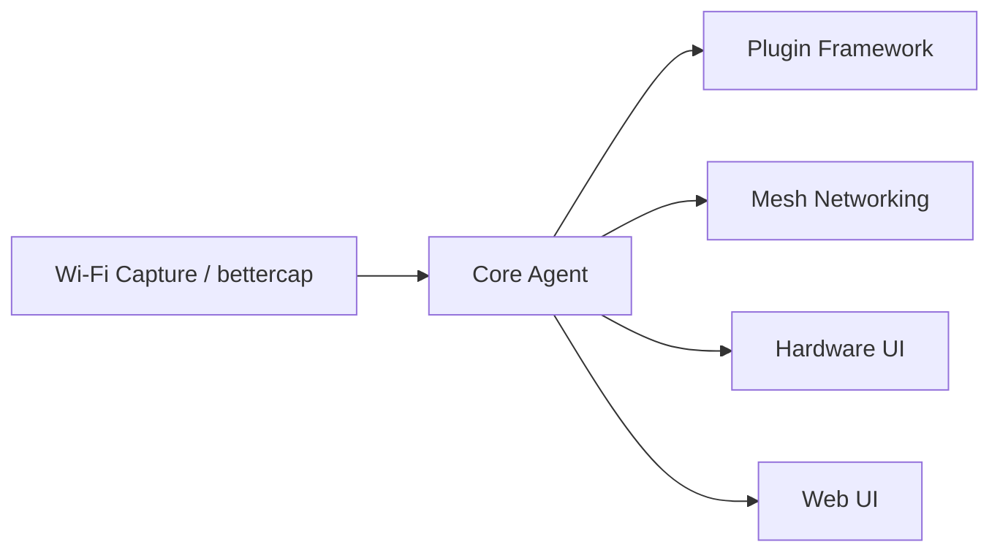

# jayofelony/pwnagotchi

> Firmware pour Raspberry Pi qui collecte des captures Wi-Fi à des fins d'audit, avec un affichage type mascotte.

## Le problème
Recueillir des échanges d'authentification Wi-Fi pour évaluer la robustesse de mots de passe réseau demande du matériel dédié et une installation manuelle.

## Ce que ça fait vraiment
- Un Raspberry Pi pilote bettercap pour enregistrer des captures PCAPNG exploitables avec hashcat.
- L'IA des anciennes versions a été retirée pour la stabilité du firmware Wi-Fi et l'autonomie.
- Plusieurs unités proches s'annoncent entre elles par un protocole propre.
- Système de plugins, pilotes d'écrans variés, interface web, traductions.

## Comment c'est branché

## Essayer
Aucune commande dans le README ; il renvoie au wiki (github.com/jayofelony/pwnagotchi/wiki) pour l'installation.

## Coût et pièges
Matériel à acheter (RPi Zero 2W, 3, 4 ou 5 ; le Zero W 32 bits est ancien, sans nouvelles versions). Le README ne précise pas le coût logiciel. Usage licite uniquement sur des réseaux dont on a l'autorisation.

## Ce que ce n'est pas
Ce n'est plus un projet d'apprentissage automatique : l'IA a été supprimée. Ce n'est pas un outil de cassage de clés, il collecte seulement le matériel à traiter ailleurs. La licence est présente mais non identifiée par GitHub.

## Alternatives
Aucune alternative nommée dans le README.

## Pour toi
Ignorer : projet matériel de sécurité Wi-Fi, sans ML actif depuis le retrait de l'IA, donc sans intérêt pour un profil data/IA/MLOps.

