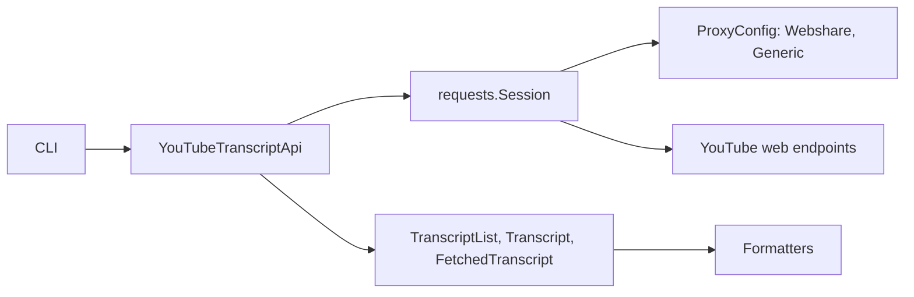

# jdepoix/youtube-transcript-api

> API Python et CLI pour récupérer les transcriptions et sous-titres de vidéos YouTube, sans navigateur headless.

## Le problème
Récupérer le texte parlé d'une vidéo sans passer par Selenium ni par une API officielle limitée.

## Ce que ça fait vraiment
Interroge les points d'accès web de YouTube, liste les transcriptions disponibles (manuelles ou générées), choisit par langue, traduit à la demande et renvoie des segments avec texte, début et durée. Des formateurs produisent JSON, texte, SRT, WebVTT ou CSV. Une couche proxy (Webshare ou proxy générique) contourne les blocages d'IP, et une session `requests` est injectable.

## Comment c'est branché


## Essayer
```bash
pip install youtube-transcript-api
youtube_transcript_api <first_video_id> <second_video_id> --languages de en
youtube_transcript_api <first_video_id> --languages en --translate de
youtube_transcript_api --list-transcripts <first_video_id>
youtube_transcript_api <video_id> --format json > transcripts.json
```

## Coût et pièges
Gratuit, mais YouTube bloque la plupart des IP de fournisseurs cloud : proxys résidentiels rotatifs (payants) à prévoir. Il faut passer l'identifiant de la vidéo, pas l'URL. L'authentification par cookies est actuellement indisponible, donc les vidéos avec limite d'âge sont inaccessibles.

## Ce que ce n'est pas
Ce n'est pas une API officielle : elle s'appuie sur une partie non documentée de YouTube, qui peut cesser de fonctionner sans préavis, comme le README l'avertit.

## Alternatives
Aucune alternative nommée dans le README (des hébergeurs sponsors sont mentionnés sans être nommés).

## Pour toi
Adopter pour alimenter un pipeline de texte (RAG, résumés) à partir de vidéos : simple et rapide à brancher, en prévoyant un proxy et une solution de repli si YouTube change son point d'accès.

