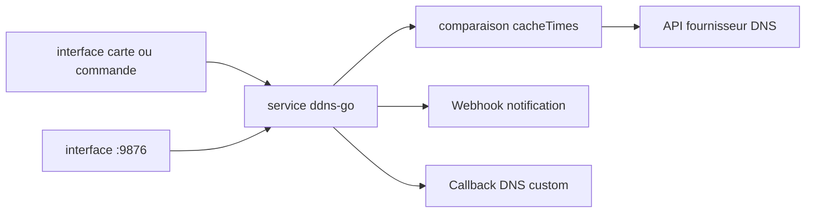

# jeessy2/ddns-go

> Récupère ton IP publique IPv4 ou IPv6 et met à jour l'enregistrement DNS correspondant.

## Le problème
Une connexion domestique change d'IP publique sans prévenir, et le nom de domaine pointe alors dans le vide.
Les scripts maison de mise à jour DNS cassent au premier changement d'API du fournisseur.

## Ce que ça fait vraiment
Synchronise par défaut toutes les 5 minutes, avec `-f` pour l'intervalle et `-cacheTimes` pour espacer les comparaisons.
Couvre une vingtaine de fournisseurs : Cloudflare, GoDaddy, Namecheap, NameSilo, Porkbun, Gcore, deSEC, Aliyun, Tencent, Huawei…
Obtient l'IP par interface réseau, appel d'API ou commande, et gère plusieurs fournisseurs et domaines à la fois.
Interface web sur le port 9876, avec les 50 derniers journaux, et l'option « interdire l'accès depuis internet » cochée par défaut.

## Comment c'est branché


## Essayer
```bash
docker run -d --name ddns-go --restart=always --net=host -v /opt/ddns-go:/root jeessy/ddns-go
```
En service système : `sudo ./ddns-go -s install -f 600 -c /Users/name/.ddns_go_config.yaml`,
puis l'interface sur `http://localhost:9876`. Réinitialisation : `./ddns-go -resetPassword 123456`.

## Coût et pièges
En exposant l'interface sur internet, le README recommande un reverse proxy avec HTTPS (Nginx).
Attention à la limitation de débit côté fournisseur si tu récupères l'IP par API avec un intervalle court.

## Ce que ce n'est pas
Pas un serveur DNS : il met à jour des enregistrements chez un fournisseur, il n'en héberge aucun.
Pas utilisable en Docker Desktop Windows/macOS pour l'IPv6 : `--net=host` n'y est pas supporté.
Pas une garantie IPv6 en machine virtuelle : l'adresse peut être obtenue sans être joignable.

## Alternatives
`Callback` — le mécanisme intégré pour couvrir un fournisseur DNS absent de la liste.
`ddns-telegram-bot` — cité pour la notification via Telegram.

## Pour toi
Hors de ton métier, mais c'est la brique qui rend ton homelab joignable : dix minutes, puis on l'oublie.
