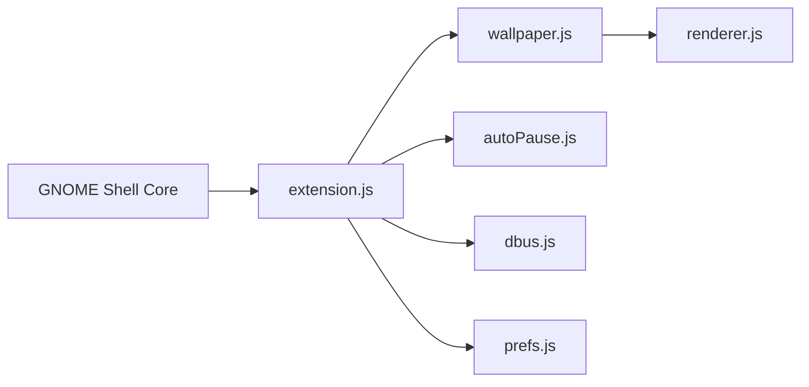

# jeffshee/gnome-ext-hanabi

> Extension GNOME Shell qui affiche une vidéo comme fond d'écran animé sur le bureau.

## Le problème
GNOME n'offre pas de fond d'écran vidéo natif.

## Ce que ça fait vraiment
Lit une vidéo en fond via GStreamer (`gtk4paintablesink`, ou `clappersink` en option), avec pause automatique, menu de panneau et préférences. La branche principale est réécrite en TypeScript pour GNOME 50+ sous Wayland uniquement ; la branche `javascript` reste en maintenance pour GNOME 45–50. Un guide de scripts existe. Risque de plantage connu avec `clappersink` et GStreamer 1.26+.

## Comment c'est branché


## Essayer
```bash
git clone https://github.com/jeffshee/gnome-ext-hanabi.git
cd gnome-ext-hanabi
make install
```
Branche ancienne : `git clone https://github.com/jeffshee/gnome-ext-hanabi.git -b javascript`.

## Coût et pièges
Gratuit ; meson (plus node et npm sur main). Redémarrer GNOME Shell. Consommation GPU/CPU due à la lecture vidéo permanente.

## Ce que ce n'est pas
Pas compatible X11 sur la nouvelle branche. Pas un outil de productivité.

## Alternatives
Aucune alternative nommée dans le README.

## Pour toi
À ignorer : décoration de bureau, sans rapport avec la donnée ou l'IA.

