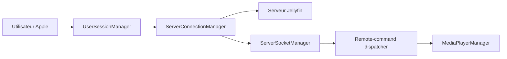

# jellyfin/Swiftfin

> Client vidéo natif Apple (iOS, tvOS) pour serveurs multimédia Jellyfin.

## Le problème
Regarder sa bibliothèque Jellyfin sur appareils Apple avec un rendu natif et de la lecture directe.

## Ce que ça fait vraiment
Restaure la session utilisateur, résout l'adresse joignable du serveur (sonde de l'endpoint public d'info système), maintient une socket temps réel pour les commandes distantes, puis lit via un lecteur natif ou VLC. Écrans d'administration serveur, guide TV en direct, cache d'images Nuke.

## Comment c'est branché


## Essayer
```bash
# Aucune commande dans le README : installation via App Store ou TestFlight.
```

## Coût et pièges
Nécessite un serveur Jellyfin existant et un appareil Apple. Le TestFlight sert à tester les nouveautés avant publication.

## Ce que ce n'est pas
Pas un serveur : uniquement un client. Le câblage entre catalogue et lecteur n'est pas établi par l'analyse du code.

## Alternatives
- Aucune alternative citée dans le README.

## Pour toi
À ignorer : client de streaming grand public sans lien avec les métiers data/IA/MLOps.

